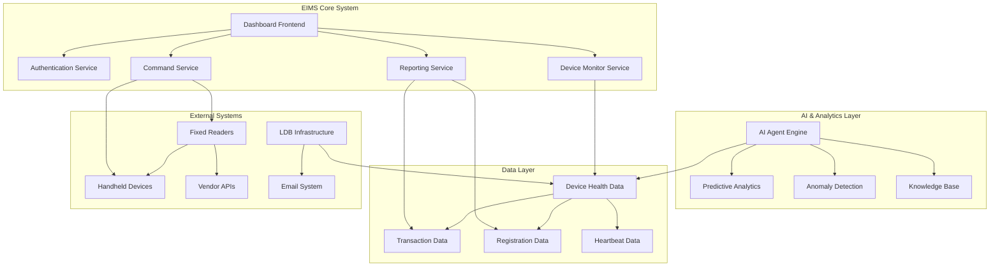

# EIMS Technical Workflows Overview

## **Executive Summary**

This document outlines the technical workflows for the Edge Infra Management System (EIMS), designed to monitor and manage 5,000+ RFID readers across 800+ toll plazas. Each workflow is designed to integrate seamlessly with the existing LDB infrastructure while providing advanced monitoring, control, and analytics capabilities.

---

## **Workflow Categories**

### **1. Core System Workflows**
- **[Workflow 1: Device Status Monitoring](./Workflow_1_Device_Status_Monitoring.md)** - Real-time monitoring of 5,000+ devices
- **[Workflow 2: Remote Device Management](./Workflow_2_Remote_Device_Management.md)** - Remote control and maintenance
- **[Workflow 3: User Authentication & Access Control](./Workflow_3_Authentication_Access_Control.md)** - Role-based security
- **[Workflow 4: Real-time Dashboard Operations](./Workflow_4_Dashboard_Operations.md)** - Interactive monitoring interface

### **2. Advanced AI Workflows**
- **[Workflow 5: AI Agent Operations](./Workflow_5_AI_Agent_Operations.md)** - Conversational AI and intelligent analytics

---

## **System Architecture Context**

---

## **Technology Stack Overview**

### **Frontend Technologies**
- **Dashboard Framework**: React.js with real-time updates
- **Visualization**: D3.js for device mapping and charts
- **UI Components**: Material-UI for consistent design
- **Real-time Communication**: WebSocket for live updates

### **Backend Services**
- **API Framework**: Node.js/Express or Python/FastAPI
- **Message Queue**: Integration with existing Kafka infrastructure
- **Database**: MongoDB/MySQL integration with LDB
- **Caching**: Redis for session management and real-time data

### **AI & Analytics**
- **Machine Learning**: Python with scikit-learn, TensorFlow
- **AI Agent Platform**: Langchain for conversational AI
- **Vector Database**: ChromaDB for knowledge management
- **Natural Language**: OpenAI/Claude for language processing

### **Infrastructure**
- **Containerization**: Docker for deployment
- **Orchestration**: Kubernetes for scaling
- **Monitoring**: Prometheus/Grafana integration
- **Load Balancing**: NGINX for traffic distribution

---

## **Key Performance Metrics**

### **System Performance**
- **Response Time**: <2 seconds for dashboard updates
- **Data Processing**: Real-time handling of 6M+ daily records
- **Uptime**: 99.9% system availability
- **Concurrent Users**: Support for 100+ simultaneous users

### **Device Monitoring**
- **Status Update Frequency**: Every 30 seconds
- **Alert Generation**: <1 minute for critical issues
- **Command Execution**: <30 seconds for remote operations
- **Data Accuracy**: 99.95% for device status reporting

### **AI Performance**
- **Prediction Accuracy**: >90% for device failure prediction
- **Query Response**: <3 seconds for AI agent responses
- **Anomaly Detection**: >95% accuracy with <2% false positives
- **Knowledge Retrieval**: <1 second for relevant document search

---

## **Integration Points**

### **LDB System Integration**
- **Data Access**: API integration with existing LDB services
- **Real-time Streaming**: Kafka topic subscription
- **Database Connection**: MongoDB/MySQL query optimization
- **IoT Gateway**: "5yer" system communication

### **Vendor Integration**
- **BCIL Devices**: Health parameter APIs
- **ZEBRA Systems**: Remote command interfaces
- **Multi-vendor Support**: Standardized communication protocols
- **Future Extensibility**: Plugin architecture for new vendors

### **External Services**
- **Email Notifications**: SMTP integration for alerts
- **SMS Gateway**: Critical alert notifications
- **Network Monitoring**: SNMP integration for infrastructure health
- **Security Systems**: LDAP/Active Directory integration

---

## **Security & Compliance**

### **Data Security**
- **Encryption**: End-to-end encryption for all communications
- **Authentication**: Multi-factor authentication support
- **Authorization**: Role-based access control (RBAC)
- **Audit Logging**: Comprehensive user action tracking

### **Compliance Requirements**
- **Data Privacy**: GDPR-compliant data handling
- **Industry Standards**: ISO 27001 security framework
- **Government Regulations**: Indian IT compliance requirements
- **Vendor Agreements**: Secure API access protocols

---

## **Next Steps**

1. **Review Individual Workflows**: Each workflow document provides detailed technical specifications
2. **Stakeholder Approval**: Present workflows to business and technical teams
3. **Implementation Planning**: Prioritize workflows based on business impact
4. **Resource Allocation**: Assign development teams to specific workflow areas
5. **Timeline Coordination**: Establish dependencies and delivery milestones

