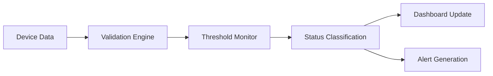
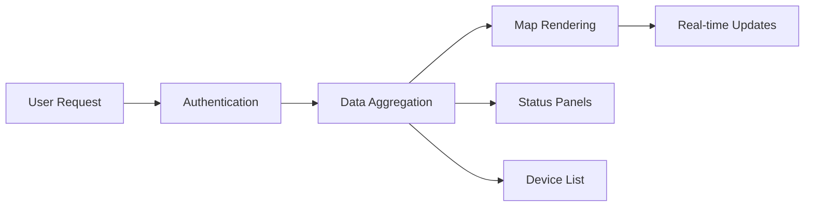
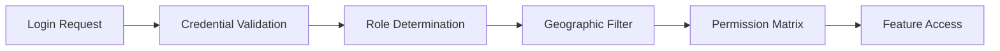
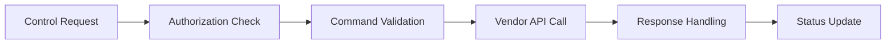
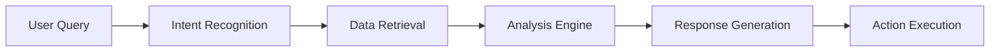
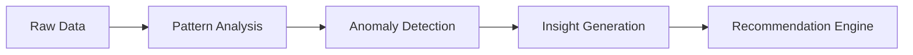
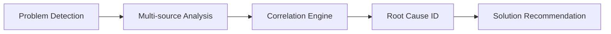

# EIMS Feature List & Technical Requirements

## **Complete Feature Specification**

This document provides a comprehensive list of all EIMS features, organized by priority, with detailed technical requirements, dependencies, and implementation guidelines.

---

## **LDB Integration Overview**

### **Existing LDB Infrastructure (Available since 2016)**

#### **Data Sources & Storage**
- **Transaction Database**: MongoDB with 4-6 million daily records (spikes to 12 million)
- **Registration Database**: MySQL with container tagging information
- **Device Metadata**: MAC IDs, locations, vendor information for 5,000+ RFID readers
- **IoT Gateway**: "5yer" system for device communication and data collection
- **Data Pipeline**: Kafka/NiFi/Hadoop infrastructure for data processing

#### **Device Management**
- **Vendor APIs**: Existing connections to BCIL, ZEBRA, IMP, ANJ device systems
- **Device Registry**: Complete inventory of 800+ toll plaza RFID installations
- **Network Infrastructure**: Communication channels to all deployed devices
- **Heartbeat Collection**: Basic device health signal gathering

#### **Business Logic**
- **Container Tracking**: A→B→C movement trail functionality
- **Transaction Processing**: Real-time container registration and movement logging
- **Basic Reporting**: Historical data export capabilities
- **User Authentication**: Existing user management system

### **EIMS Development Requirements**

#### **New Components to Develop**
```yaml
Real-time Monitoring Engine:
  - 30-minute threshold detection logic
  - Device status classification (Live/Down/Shutdown/Maintenance)
  - Real-time dashboard with geographic visualization
  - WebSocket-based live updates

Advanced User Interface:
  - React.js dashboard with interactive maps
  - Role-based access control with geographic restrictions
  - Mobile-responsive design with real-time updates
  - Alert management and notification system

Remote Device Control:
  - Command validation and execution framework
  - Multi-vendor API integration layer
  - Remote reboot/restart/refresh capabilities
  - Command audit trail and response handling

AI & Analytics Platform:
  - Conversational AI agent with natural language processing
  - Predictive maintenance with machine learning models
  - Automated troubleshooting and root cause analysis
  - Advanced analytics with pattern recognition
```

#### **Integration & Connection Points**
```yaml
LDB Data Integration:
  - Connect to existing MongoDB transaction database
  - Integrate with MySQL registration database
  - Stream data from "5yer" IoT gateway
  - Utilize existing Kafka infrastructure for real-time processing

Vendor API Enhancement:
  - Extend existing BCIL/ZEBRA/IMP/ANJ connections
  - Add command execution capabilities to existing APIs
  - Implement response validation and error handling
  - Create unified vendor abstraction layer

Authentication Extension:
  - Enhance existing user system with role-based access
  - Add geographic restrictions (state/region-based)
  - Implement multi-factor authentication
  - Create permission matrix for device access
```

---

## **Core Features**

### **F1: Real-time Device Status Monitoring**

#### **Feature Description**
Monitor 5,000+ RFID devices with 30-minute threshold detection and automated status classification.

#### **Technical Flow**


#### **Requirements**
- **Input**: Device transaction logs, heartbeat signals, health metrics
- **Processing**: 30-minute threshold detection logic, pattern analysis
- **Output**: Live/Down/Shutdown/Maintenance status classification
- **Performance**: <30 seconds update latency, 99.95% accuracy

#### **LDB Integration Status**
```yaml
✅ Available in LDB:
  - Device transaction logs (MongoDB)
  - Basic heartbeat signals ("5yer" IoT gateway)
  - Device MAC IDs and location metadata
  - Kafka infrastructure for data streaming

🔧 Need to Develop:
  - 30-minute threshold detection engine
  - Status classification logic (Live/Down/Shutdown/Maintenance)
  - Real-time processing pipeline
  - WebSocket communication for live updates

🔗 Need to Connect:
  - LDB MongoDB transaction data stream
  - "5yer" IoT gateway heartbeat signals
  - Existing Kafka topics for real-time processing
```

#### **Dependencies**
- LDB data integration service
- Real-time message queue (Kafka)
- MongoDB/MySQL database access
- WebSocket communication

#### **Tech Stack**
- **Backend**: Node.js/Python with Express/FastAPI
- **Database**: MongoDB with time-series optimization
- **Queue**: Apache Kafka for data streaming
- **Cache**: Redis for real-time status

---

### **F2: Interactive Dashboard Interface**

#### **Feature Description**
Web-based dashboard with geographic map, status panels, device details, and real-time updates.

#### **Technical Flow**


#### **Requirements**
- **Components**: Interactive map, status summaries, device list, alert center
- **Real-time**: WebSocket updates every 30 seconds
- **Responsive**: Desktop, tablet, mobile support
- **Performance**: <3 seconds initial load, <2 seconds interactions
- **Advanced Features**: 
  - Last TAG Read Status with flexible timeframe (12/18 months configurable)
  - Last Registration Status visibility and history tracking
  - CLIENT user read-only dashboard interface

#### **LDB Integration Status**
```yaml
✅ Available in LDB:
  - Device location data (lat/lng coordinates)
  - Basic device information (MAC IDs, vendor details)
  - Historical transaction data for reporting
  - User authentication system (to be enhanced)

🔧 Need to Develop:
  - React.js dashboard with interactive maps
  - Real-time WebSocket communication
  - Geographic visualization with device status overlay
  - Mobile-responsive interface design
  - Role-based dashboard customization (including CLIENT read-only access)
  - Last TAG Read Status with flexible timeframe selector (12/18 months)
  - Last Registration Status display and history tracking
  - Advanced status timeline visualization

🔗 Need to Connect:
  - LDB device location database
  - Real-time status updates from monitoring engine
  - User authentication system integration
```

#### **Dependencies**
- Device status monitoring service
- Geographic mapping service
- User authentication system
- Real-time data streaming

#### **Tech Stack**
- **Frontend**: React.js with Material-UI
- **Maps**: Leaflet.js with OpenStreetMap
- **Charts**: Chart.js/D3.js for visualizations
- **Real-time**: Socket.io for live updates

---

### **F3: Role-Based Access Control**

#### **Feature Description**
Multi-level authentication with geographic restrictions and permission-based feature access.

#### **Technical Flow**


#### **Requirements**
- **Roles**: NEC General (full access), NEC Engineer (regional), NEC Admin (device management), CLIENT (dashboard view only)
- **Security**: Multi-factor authentication, session management
- **Geographic**: State/region-based device visibility
- **Audit**: Complete action logging and tracking

#### **LDB Integration Status**
```yaml
✅ Available in LDB:
  - Basic user authentication system
  - User database with credentials
  - Device location data for geographic filtering
  - Basic audit logging infrastructure

🔧 Need to Develop:
  - Role-based permission matrix (NEC General/Engineer/Admin/CLIENT)
  - Geographic access restrictions (state/region-based)
  - Multi-factor authentication (SMS/Email OTP)
  - Enhanced session management with JWT tokens
  - Comprehensive audit logging for all actions

🔗 Need to Connect:
  - Existing LDB user database
  - Device location data for regional restrictions
  - Extend current authentication with role-based access
```

#### **Dependencies**
- User database/LDAP integration
- Session storage (Redis)
- SMS/Email services for MFA
- Audit logging system

#### **Tech Stack**
- **Authentication**: JWT tokens with 8-hour expiration
- **MFA**: SMS OTP, Email verification
- **Storage**: PostgreSQL for user data
- **Session**: Redis for session management

---

### **F4: Remote Device Control**

#### **Feature Description**
Remote reboot, restart, refresh capabilities with vendor API integration and command validation.

#### **Technical Flow**


#### **Requirements**
- **Commands**: Reboot (full restart), Restart (service), Refresh (config reload)
- **Validation**: User permissions, device capabilities, safety checks
- **Execution**: <30 seconds completion, >98% success rate
- **Vendors**: BCIL, ZEBRA, IMP, ANJ device support

#### **LDB Integration Status**
```yaml
✅ Available in LDB:
  - Existing vendor API connections (BCIL, ZEBRA, IMP, ANJ)
  - Device communication channels through "5yer" gateway
  - Device registry with vendor-specific information
  - Network infrastructure to reach all devices

🔧 Need to Develop:
  - Remote command execution framework
  - Command validation and safety checks
  - Multi-vendor command abstraction layer
  - Response handling and status tracking
  - Command queue management system
  - Audit trail for all remote operations

🔗 Need to Connect:
  - Extend existing vendor APIs with command capabilities
  - Integrate with "5yer" gateway for command transmission
  - Connect to device registry for command validation
```

#### **Dependencies**
- Vendor API availability
- Device communication channels
- Command queue management
- Response validation system

#### **Tech Stack**
- **APIs**: REST/SOAP integration with vendor systems
- **Queue**: Redis for command queuing
- **Security**: Encrypted command transmission
- **Logging**: Complete command audit trail

---

## **Advanced Features**

### **F5: Automated Alert Management**

#### **Feature Description**
Intelligent alert generation, escalation, and notification system with configurable thresholds.

#### **Technical Flow**


#### **Requirements**
- **Triggers**: Device down (60+ min), health thresholds, pattern anomalies
- **Escalation**: Role-based alert routing, time-based escalation
- **Delivery**: Email, SMS, dashboard notifications
- **Management**: Acknowledge, resolve, assign, add notes

#### **LDB Integration Status**
```yaml
✅ Available in LDB:
  - Basic device health monitoring
  - Kafka infrastructure for event streaming
  - User contact information database
  - Historical data for pattern analysis

🔧 Need to Develop:
  - Intelligent alert generation engine
  - Multi-level escalation logic
  - SMS/Email notification system
  - Alert management dashboard
  - Configurable threshold settings
  - Alert acknowledgment and resolution tracking

🔗 Need to Connect:
  - Device monitoring data from LDB
  - User database for notification preferences
  - Kafka event streams for real-time alerting
```

#### **Dependencies**
- Device monitoring service
- Email/SMS gateway services
- User notification preferences
- Alert history database

#### **Tech Stack**
- **Processing**: Apache Kafka for alert streaming
- **Notifications**: SendGrid for email, Twilio for SMS
- **Storage**: MongoDB for alert history
- **Queue**: Bull.js for alert processing

---

### **F6: Comprehensive Reporting**

#### **Feature Description**
Automated report generation with Excel/PDF export, scheduled delivery, and custom filters.

#### **Technical Flow**


#### **Requirements**
- **Types**: Device uptime/downtime, performance summaries, trend analysis
- **Formats**: Excel (XLSX), PDF, CSV export options
- **Scheduling**: Daily, weekly, monthly automated reports
- **Filters**: Location, device type, date range, status

#### **LDB Integration Status**
```yaml
✅ Available in LDB:
  - Historical transaction data (MongoDB)
  - Device metadata and location information
  - Basic reporting capabilities (data export)
  - Hadoop infrastructure for large data processing

🔧 Need to Develop:
  - Advanced report generation engine
  - Excel/PDF template system
  - Automated scheduling and delivery
  - Interactive report builder
  - Custom filtering and aggregation
  - Report performance optimization

🔗 Need to Connect:
  - LDB historical data repositories
  - Device registry for metadata enrichment
  - User preferences for report customization
```

#### **Dependencies**
- Historical data storage
- Report template system
- File generation libraries
- Email delivery system

#### **Tech Stack**
- **Generation**: Node.js with ExcelJS, PDFKit
- **Templates**: Dynamic report templates
- **Storage**: AWS S3 for report storage
- **Scheduling**: Cron jobs for automated reports

---

### **F7: Predictive Maintenance**

#### **Feature Description**
Machine learning-based failure prediction with maintenance recommendations and scheduling.

#### **Technical Flow**


#### **Requirements**
- **Prediction**: 7-30 day failure probability with >90% accuracy
- **Features**: CPU/RAM trends, temperature patterns, error rates
- **Recommendations**: Optimal maintenance windows, preventive actions
- **Integration**: Alert system, maintenance workflow

#### **LDB Integration Status**
```yaml
✅ Available in LDB:
  - Historical device health data (since 2016)
  - Transaction patterns and device usage data
  - Environmental data from device sensors
  - Hadoop infrastructure for big data processing

🔧 Need to Develop:
  - Machine learning model training pipeline
  - Feature engineering for predictive analytics
  - Failure prediction algorithms
  - Maintenance recommendation engine
  - Model performance monitoring and retraining
  - Integration with maintenance scheduling systems

🔗 Need to Connect:
  - Historical data from LDB repositories
  - Real-time device health streams
  - Maintenance scheduling systems
```

#### **Dependencies**
- Historical device health data
- ML training infrastructure
- Feature engineering pipeline
- Maintenance scheduling system

#### **Tech Stack**
- **ML**: Python with scikit-learn, TensorFlow
- **Processing**: Apache Spark for big data
- **Storage**: InfluxDB for time-series data
- **API**: FastAPI for prediction endpoints

---

## **AI-Powered Features**

### **F8: Conversational AI Agent**

#### **Feature Description**
Natural language interface for system interaction, analysis, and troubleshooting assistance.

#### **Technical Flow**


#### **Requirements**
- **Capabilities**: Device queries, status analysis, troubleshooting guidance
- **Interface**: Text chat, voice input, quick action buttons
- **Intelligence**: Context awareness, learning from interactions
- **Performance**: <3 seconds response time, >95% intent accuracy

#### **LDB Integration Status**
```yaml
✅ Available in LDB:
  - Comprehensive device and transaction data
  - Historical troubleshooting procedures
  - System documentation and knowledge base
  - Real-time system status information

🔧 Need to Develop:
  - Natural language processing engine
  - Conversational AI framework
  - Knowledge base vectorization
  - Intent recognition and response generation
  - Context management and learning system
  - Voice-to-text and text-to-speech capabilities

🔗 Need to Connect:
  - LDB data sources for real-time queries
  - System documentation for knowledge base
  - Device status monitoring for contextual awareness
```

#### **Dependencies**
- Natural language processing models
- Knowledge base integration
- Real-time system data access
- User context management

#### **Tech Stack**
- **NLP**: OpenAI GPT/Claude for language processing
- **Framework**: Langchain for AI agent development
- **Vector DB**: ChromaDB for knowledge storage
- **Interface**: React with speech-to-text

---

### **F9: Intelligent Analytics**

#### **Feature Description**
Advanced analytics with pattern recognition, anomaly detection, and business intelligence.

#### **Technical Flow**


#### **Requirements**
- **Analytics**: Traffic patterns, performance trends, vendor comparisons
- **Detection**: Unusual behavior, performance degradation, security threats
- **Insights**: Root cause analysis, optimization opportunities
- **Visualization**: Interactive dashboards, drill-down capabilities

#### **LDB Integration Status**
```yaml
✅ Available in LDB:
  - Rich historical data (9+ years of operations)
  - Multi-vendor device data for comparison
  - Transaction patterns and traffic data
  - Hadoop/NiFi infrastructure for big data analytics

🔧 Need to Develop:
  - Advanced analytics engine
  - Pattern recognition algorithms
  - Anomaly detection models
  - Interactive visualization dashboard
  - Business intelligence reporting
  - Performance benchmarking system

🔗 Need to Connect:
  - LDB data warehouse for historical analysis
  - Real-time data streams for live analytics
  - Vendor-specific data sources for comparison
```

#### **Dependencies**
- Historical data warehouse
- Analytics processing engine
- Visualization framework
- Real-time data streams

#### **Tech Stack**
- **Analytics**: Apache Spark for big data processing
- **ML**: Python with pandas, scikit-learn
- **Visualization**: D3.js, Plotly for advanced charts
- **Storage**: Apache Druid for analytics database

---

### **F10: Automated Troubleshooting**

#### **Feature Description**
AI-powered root cause analysis with automated resolution suggestions and workflow guidance.

#### **Technical Flow**


#### **Requirements**
- **Analysis**: Multi-dimensional problem correlation
- **Sources**: Device health, network metrics, environmental data
- **Solutions**: Step-by-step procedures, escalation criteria
- **Learning**: Improve recommendations based on outcomes

#### **LDB Integration Status**
```yaml
✅ Available in LDB:
  - Historical problem and resolution data
  - Device health metrics and error logs
  - Network performance data
  - Troubleshooting documentation and procedures

🔧 Need to Develop:
  - Multi-source correlation engine
  - Root cause analysis algorithms
  - Automated solution recommendation system
  - Machine learning for pattern recognition
  - Feedback loop for continuous improvement
  - Integration with knowledge management system

🔗 Need to Connect:
  - LDB monitoring data sources
  - Historical troubleshooting records
  - Real-time system health indicators
```

#### **Dependencies**
- Comprehensive monitoring data
- Knowledge base of solutions
- Correlation analysis engine
- Feedback collection system

#### **Tech Stack**
- **Analysis**: Python with networkx for correlation
- **Knowledge**: Vector database for solution storage
- **ML**: Clustering and classification algorithms
- **API**: GraphQL for complex data queries

---

## **Supporting Features**

### **F11: Configuration Management**

#### **Feature Description**
Centralized device and system configuration with version control and rollback capabilities.

#### **Requirements**
- **Device Config**: Remote parameter updates, bulk operations
- **System Config**: Thresholds, alerts, user settings
- **Versioning**: Configuration history, rollback functionality
- **Validation**: Pre-deployment testing, conflict detection

#### **Tech Stack**
- **Storage**: Git-based configuration versioning
- **API**: REST endpoints for configuration management
- **Validation**: JSON schema validation
- **Deployment**: Ansible for configuration deployment

---

### **F12: API Management**

#### **Feature Description**
RESTful API layer for third-party integrations and mobile applications.

#### **Requirements**
- **Endpoints**: Device data, commands, reports, analytics
- **Security**: API keys, rate limiting, authentication
- **Documentation**: Interactive API documentation
- **Versioning**: Backward compatibility, deprecation management

#### **Tech Stack**
- **Framework**: FastAPI with automatic documentation
- **Security**: OAuth2 with JWT tokens
- **Gateway**: Kong for API management
- **Documentation**: Swagger/OpenAPI 3.0

---

### **F13: Weather Integration & Environmental Impact Analysis**

#### **Feature Description**
Real-time weather data integration for predictive impact analysis and proactive device management across India's diverse geographic regions.

#### **Technical Flow**


#### **Requirements**
- **Weather Sources**: IMD API, OpenWeatherMap, AccuWeather integration
- **Regional Monitoring**: Location-specific weather tracking for 800+ toll plazas
- **Impact Analysis**: Weather-device correlation models
- **Proactive Alerts**: 48-72 hour advance warnings for severe weather

#### **Use Cases & Scenarios**

##### **Mountain Regions (Himachal, Kashmir, Uttarakhand)**
```
Weather Alert: Heavy snowfall predicted in Shimla region
↓
EIMS Response:
- Alert maintenance teams 48 hours in advance
- Pre-stage backup devices near affected toll plazas
- Activate remote monitoring protocols
- Prepare alternate traffic routing recommendations
```

##### **Coastal Areas (Mumbai, Chennai, Kolkata)**
```
Weather Alert: Cyclone approaching Mumbai coast
↓
EIMS Response:
- Secure outdoor equipment at coastal toll plazas
- Switch to backup power systems
- Enable emergency communication protocols
- Coordinate with traffic management authorities
```

##### **Monsoon-Prone Regions**
```
Weather Alert: Heavy rainfall warning for Gujarat highways
↓
EIMS Response:
- Monitor drainage systems at toll plazas
- Check waterproofing of RFID equipment
- Prepare flood-resistant device configurations
- Alert field teams for rapid response
```

#### **Technical Integration Points**

##### **Weather Data Sources**
- **IMD API**: India Meteorological Department official forecasts
- **OpenWeatherMap API**: Global weather data and alerts
- **AccuWeather API**: Enhanced forecasting accuracy
- **Local Sensors**: Temperature, humidity, wind speed at toll plazas

#### **LDB Integration Status**
```yaml
✅ Available in LDB:
  - Geographic location data for all toll plazas
  - Historical device failure correlation data
  - Infrastructure for API integrations

🔧 Need to Develop:
  - Weather API integration layer
  - Weather-device correlation analysis engine
  - Proactive alert and response system

🔗 Need to Connect:
  - External weather service APIs
  - Emergency response coordination systems
  - Regional maintenance team communication
```

#### **Dependencies**
- Weather API subscriptions and rate limits
- Geographic mapping of toll plaza locations
- Historical weather-device correlation data
- Emergency response team coordination protocols

#### **Tech Stack**
- **APIs**: Weather service integrations with fallback mechanisms
- **Processing**: Node.js weather data aggregation service
- **Storage**: MongoDB for weather history and correlation data
- **Analytics**: Python ML models for weather-device impact prediction
- **Alerts**: Integration with existing notification systems

---
