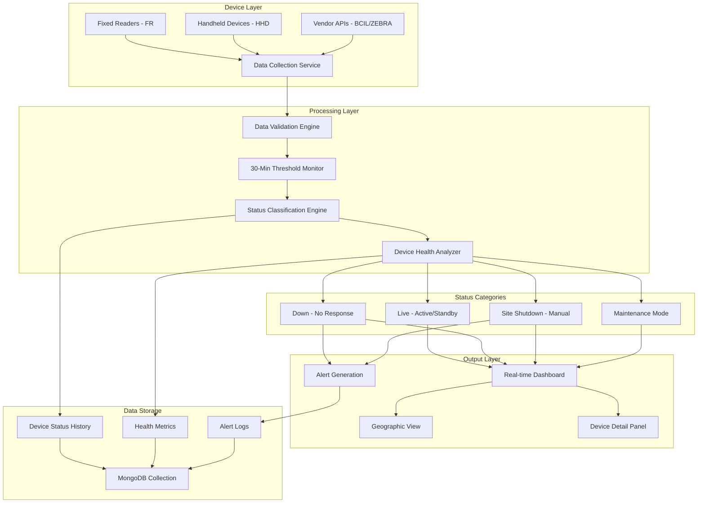
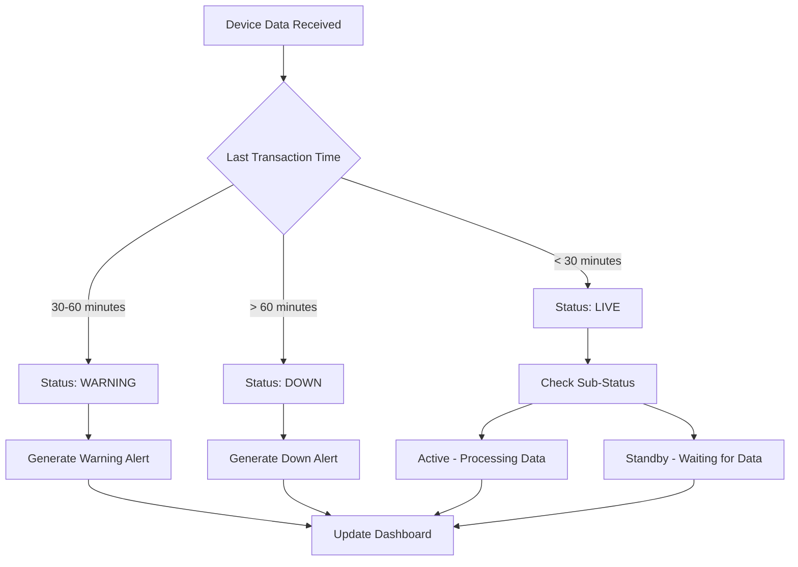
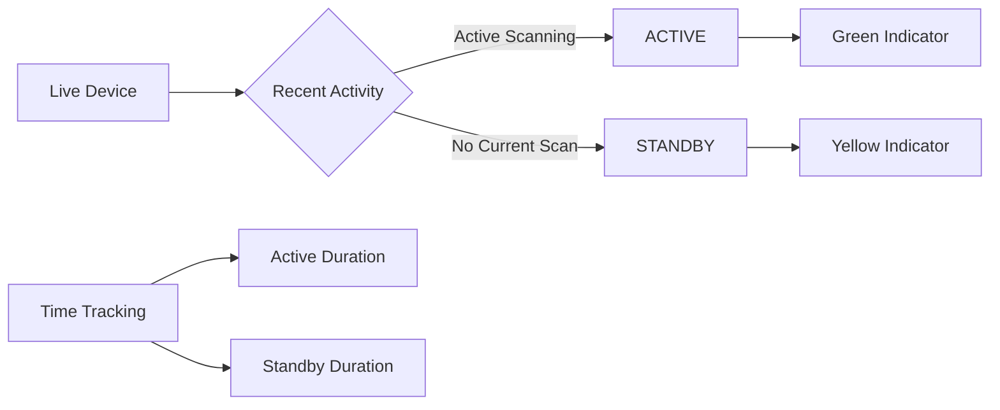
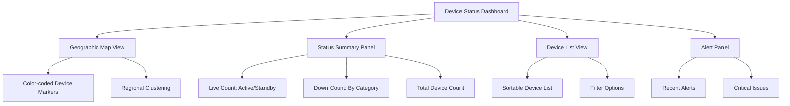
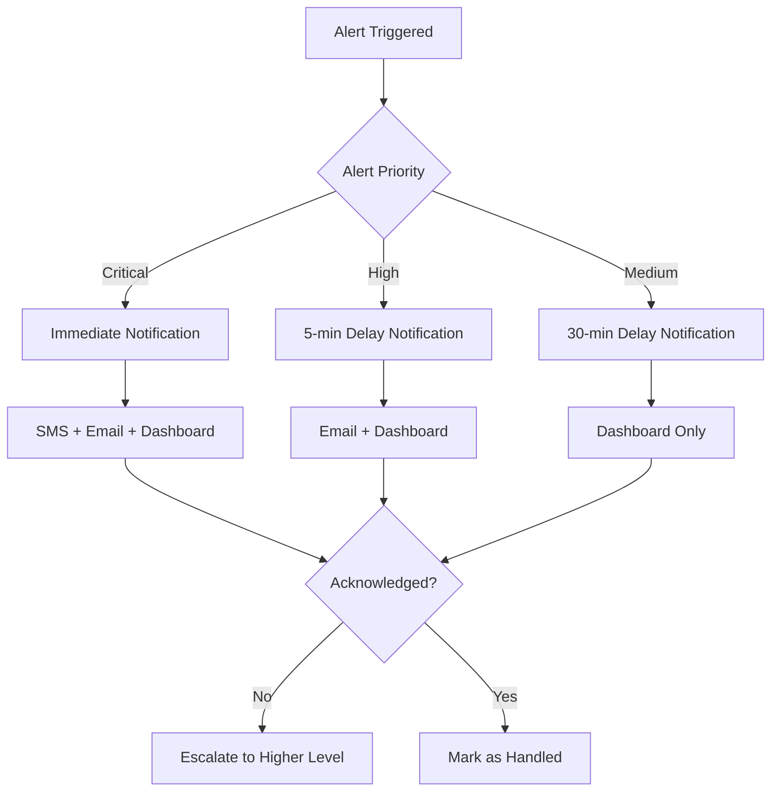
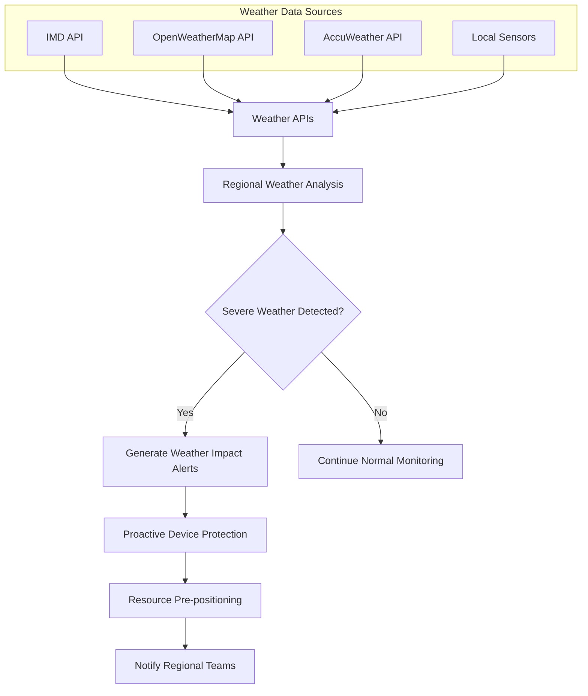
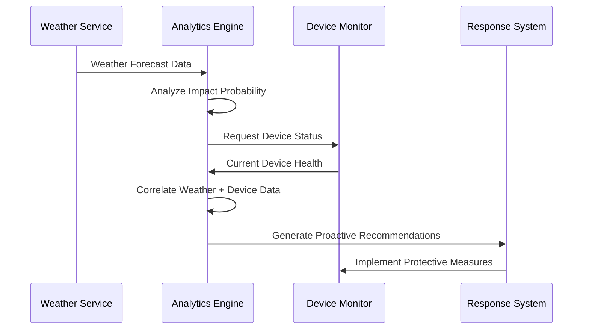

# Workflow 1: Device Status Monitoring

## **Overview**
Real-time monitoring of 5,000+ RFID Fixed Readers (FR) and Handheld Devices (HHD) across 800+ toll plazas, providing comprehensive device health visibility and automated status classification.

## **Business Objectives**
- Ensure 99.5% device uptime across the network
- Provide real-time visibility into device health status
- Enable proactive maintenance through early issue detection
- Maintain continuous container tracking capabilities

## **Workflow Architecture**



## **Detailed Process Flow**

### **Step 1: Data Collection & Validation**

#### **1.1 Fixed Reader Data Collection**
- **Frequency**: Every 30 seconds
- **Data Sources**: Transaction logs, heartbeat signals, health parameters
- **Validation**: Schema validation, timestamp verification, device authentication

#### **1.2 Handheld Device Data Collection**
- **Frequency**: Every transaction or manual check-in
- **Data Sources**: Transaction logs, GPS location (if available)
- **Limitation**: No native heartbeat (requires custom APK for health data)

#### **1.3 Vendor API Integration**
- **BCIL Integration**: CPU, RAM, temperature, antenna status
- **ZEBRA Integration**: Device configuration, error logs, performance metrics
- **Data Formats**: JSON REST APIs, real-time streaming

### **Step 2: 30-Minute Threshold Monitoring**



#### **2.1 Threshold Logic**
- **Live Status**: Data received within 30 minutes
- **Warning Status**: No data for 30-60 minutes (configurable)
- **Down Status**: No data for 60+ minutes
- **Critical Status**: No data for 120+ minutes

#### **2.2 Container Traffic Analysis**
- **Expected Traffic**: 10-20 containers per hour per toll plaza
- **Pattern Recognition**: Analyze historical traffic patterns
- **Anomaly Detection**: Identify unusual traffic gaps
- **Context Awareness**: Consider time of day, day of week patterns

### **Step 3: Status Classification Engine**

#### **3.1 Live Status Sub-Classification**


#### **3.2 Down Status Analysis**
- **Automatic Classification**: Based on response patterns
- **Manual Override**: Admin can manually classify reasons
- **Root Cause Categories**:
  - Power outage
  - Network connectivity issues
  - Device hardware failure
  - Software malfunction

#### **3.3 Site Shutdown Management**
- **Manual Classification**: Admin-controlled status
- **Shutdown Reasons**:
  - Scheduled maintenance
  - Power infrastructure issues
  - Network infrastructure problems
  - Device replacement (RMA)
- **Status Persistence**: Maintain until manual status change

### **Step 4: Real-time Dashboard Updates**

#### **4.1 Dashboard Components**


#### **4.2 Device Information Panel (Hover/Click)**
- **Device Identity**: MAC ID, make/model, device type
- **Location Details**: Exact location, toll plaza ID, state/region
- **Health Parameters**: CPU utilization, RAM usage, temperature
- **Operational Data**: Last transaction time, uptime, traffic count
- **Status History**: Recent status changes, maintenance logs

### **Step 5: Alert Generation & Management**

#### **5.1 Alert Triggers**
- **Device Down**: No response for 60+ minutes
- **Critical Health**: CPU >90%, Temperature >threshold
- **Pattern Anomaly**: Unusual traffic patterns detected
- **Multiple Failures**: Multiple devices down in same area

#### **5.2 Alert Escalation**


---

### **Step 6: Weather-Enhanced Monitoring**

#### **6.1 Environmental Data Integration**


#### **6.2 Weather Impact Scenarios**

##### **Extreme Temperature Monitoring**
- **High Temperature (>45°C)**: Device performance degradation prediction
- **Low Temperature (<5°C)**: Battery performance and hardware stress monitoring
- **Rapid Temperature Changes**: Thermal stress analysis and prevention

##### **Precipitation Impact Analysis**
- **Heavy Rainfall (>50mm/hr)**: Waterproofing and drainage monitoring
- **Flooding Risk**: Power system backup and connectivity protection
- **Hail/Ice**: Physical equipment damage assessment

##### **Wind and Storm Monitoring**
- **High Winds (>60 kmph)**: Equipment securing and antenna stability
- **Dust Storms**: Air filtration and equipment protection protocols
- **Cyclone/Hurricane**: Emergency shutdown and protection procedures

#### **6.3 Proactive Response Matrix**
```yaml
Weather Severity Levels:
  Critical Risk (48-72 hrs advance):
    actions:
      - Pre-position maintenance teams at regional hubs
      - Activate backup power systems
      - Secure outdoor equipment and antennas
      - Enable emergency communication protocols
    monitoring:
      - Increase device health check frequency to 5-minute intervals
      - Activate environmental sensor monitoring
      - Enable predictive failure detection

  High Risk (24-48 hrs advance):
    actions:
      - Intensify device monitoring protocols
      - Prepare emergency response teams
      - Alert regional coordinators
      - Test backup communication systems
    monitoring:
      - Increase monitoring frequency to 10-minute intervals
      - Monitor critical device parameters closely
      
  Medium Risk (12-24 hrs advance):
    actions:
      - Real-time weather tracking activation
      - Ready rapid response teams
      - Monitor critical toll plaza devices
      - Prepare equipment protection measures
    monitoring:
      - Standard monitoring with weather correlation
      - Enhanced alert sensitivity
      
  Low Risk (0-12 hrs):
    actions:
      - Normal operations with weather awareness
      - Monitor local weather conditions
      - Standard response protocols
    monitoring:
      - Regular monitoring intervals
      - Weather data logging for analysis
```

#### **6.4 Weather-Device Correlation Analysis**


##### **Regional Weather Patterns**
- **Monsoon Impact Analysis**: June-September device performance correlation
- **Winter Weather Effects**: December-February cold weather impact on northern regions  
- **Summer Heat Stress**: April-June temperature-device performance analysis
- **Cyclone Season Preparation**: Pre-monsoon and post-monsoon storm readiness

##### **Predictive Weather Models**
- **Device Failure Probability**: Weather conditions vs historical failure rates
- **Performance Degradation**: Temperature/humidity impact on RFID read accuracy
- **Power System Stress**: Extreme weather impact on power consumption and backup systems
- **Communication Reliability**: Weather-related network connectivity issues

#### **6.5 Integration with Existing Alerts**
```yaml
Enhanced Alert Categories:
  Weather-Proactive:
    - "Severe weather approaching - Device protection recommended"
    - "Extreme temperature forecast - Monitor device performance"
    - "Heavy rainfall predicted - Check drainage systems"
    
  Weather-Reactive:
    - "Weather-related device performance degradation detected"
    - "Environmental conditions affecting RFID accuracy"
    - "Power system stress due to extreme weather"
    
  Weather-Recovery:
    - "Weather conditions improving - Resume normal operations"
    - "Post-storm device assessment required"
    - "Environmental conditions normalized"
```

---

## **Technical Requirements**

### **Database Schema**
```
Device Status Collection:
- device_id (string)
- mac_address (string)
- device_type (enum: FR, HHD)
- location_id (string)
- timestamp (datetime)
- status (enum: live, down, shutdown, maintenance)
- sub_status (enum: active, standby)
- health_metrics (object)
- last_transaction (datetime)
- uptime_duration (number)
```

### **API Endpoints**
- `GET /api/devices/status` - Retrieve all device statuses
- `GET /api/devices/{id}/status` - Get specific device status
- `GET /api/devices/location/{location}` - Get devices by location
- `POST /api/devices/{id}/status` - Update device status manually
- `GET /api/devices/health/{id}` - Get device health metrics

### **Real-time Updates**
- **WebSocket Connection**: For live dashboard updates
- **Update Frequency**: Every 30 seconds for status, 5 minutes for health
- **Data Compression**: Optimized payload for mobile devices
- **Offline Handling**: Graceful degradation when connection lost

## **Success Metrics**

### **System Performance**
- **Status Update Latency**: <30 seconds
- **Dashboard Response Time**: <2 seconds
- **Alert Generation Time**: <1 minute
- **Data Accuracy**: 99.95%

### **Business Impact**
- **Uptime Improvement**: 15% increase in device availability
- **MTTR Reduction**: 40% faster issue resolution
- **False Alert Reduction**: <5% false positive rate
- **Operator Efficiency**: 30% faster status assessment

## **Dependencies**

### **Internal Dependencies**
- LDB data integration service
- User authentication system
- Alert notification service
- Geographic mapping service

### **External Dependencies**
- Vendor API availability (BCIL, ZEBRA)
- Network connectivity to remote devices
- Email/SMS gateway services
- Database performance and availability

## **Risk Mitigation**

### **High Data Volume**
- **Solution**: Implement data partitioning and indexing
- **Backup**: Use caching layer for frequently accessed data

### **Network Connectivity**
- **Solution**: Offline mode with data synchronization
- **Backup**: Multiple communication channels (primary/secondary)

### **Vendor API Reliability**
- **Solution**: Fallback to basic status monitoring
- **Backup**: Local health data collection where possible
