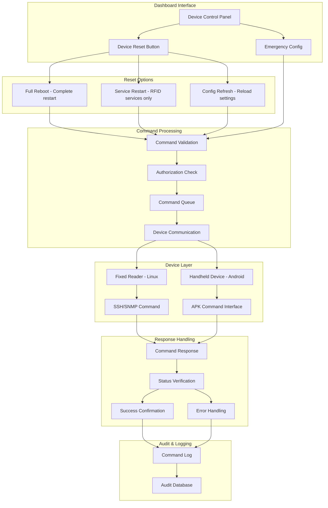
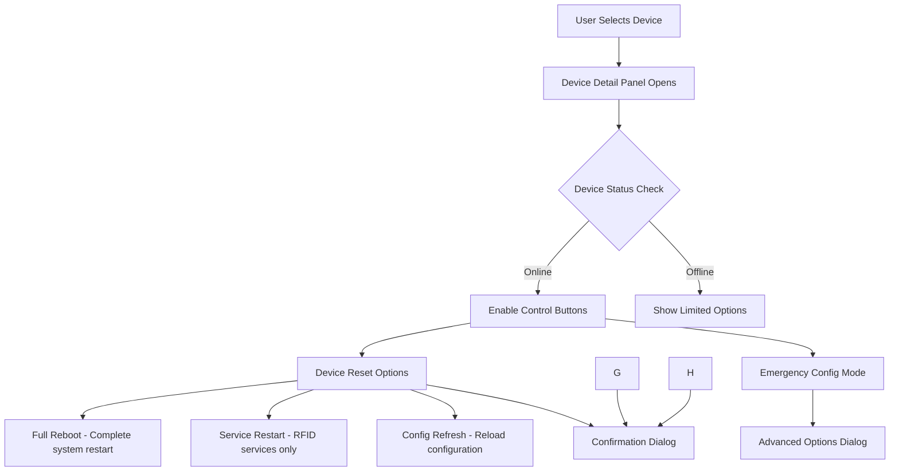
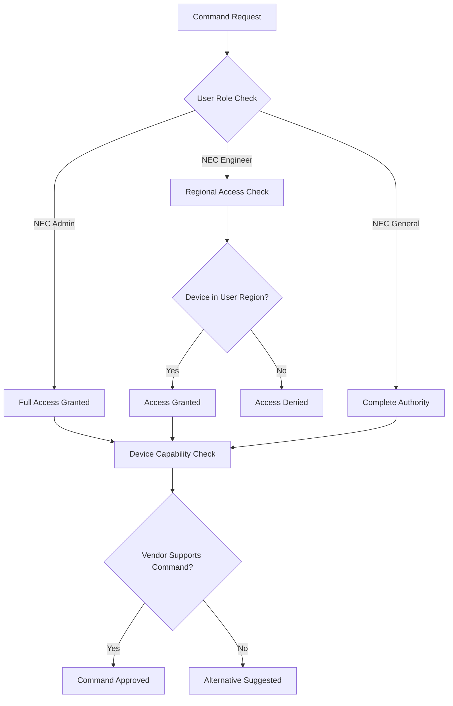
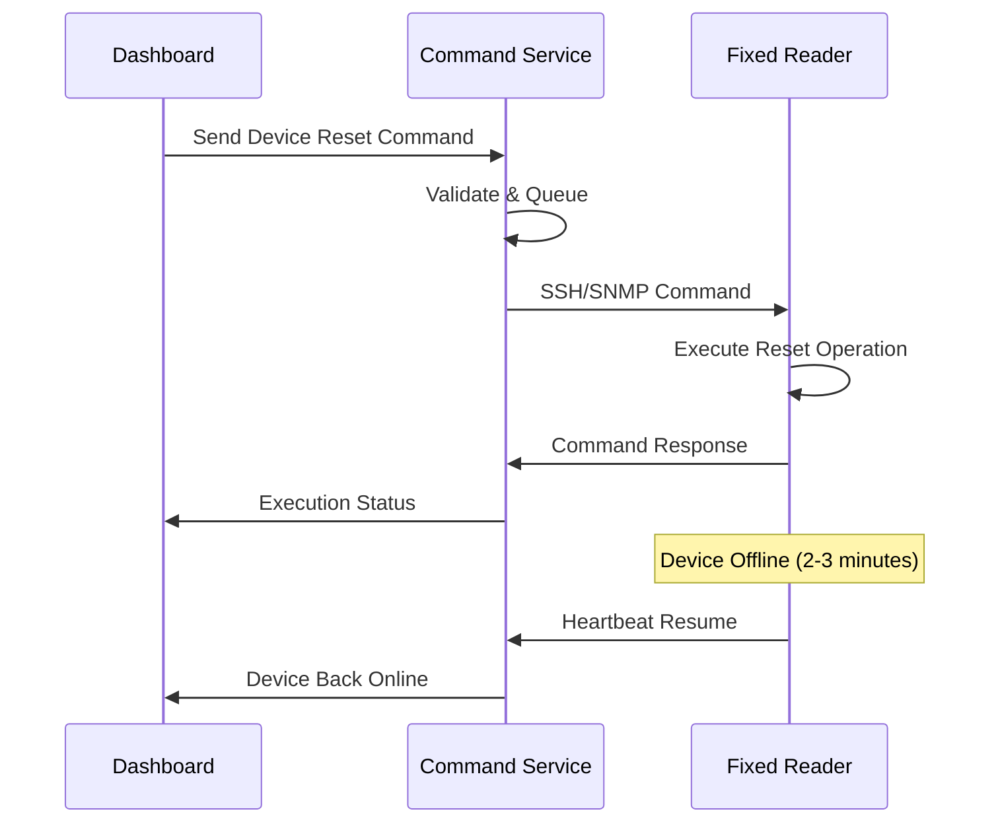
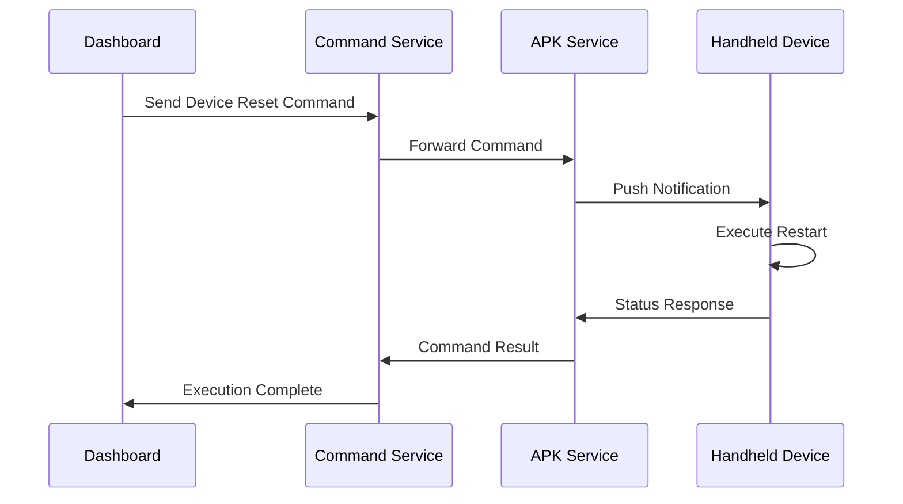
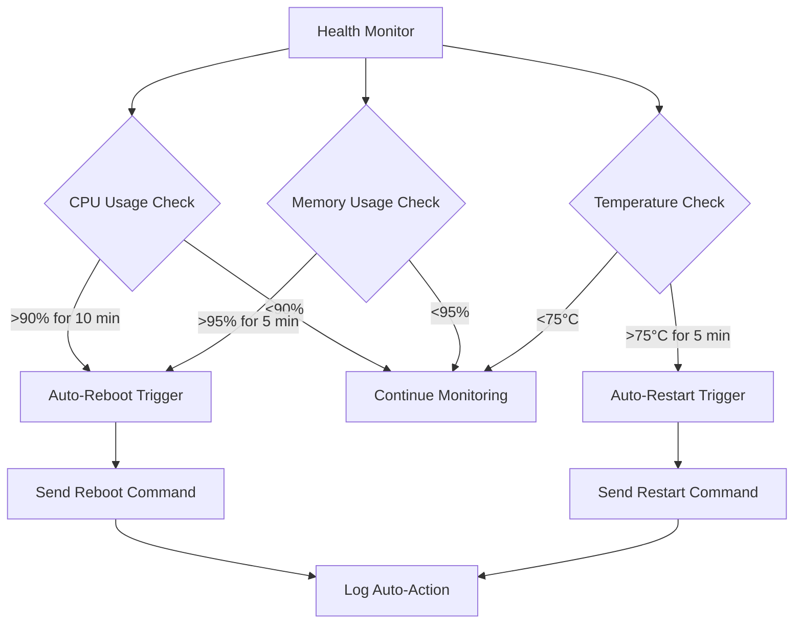
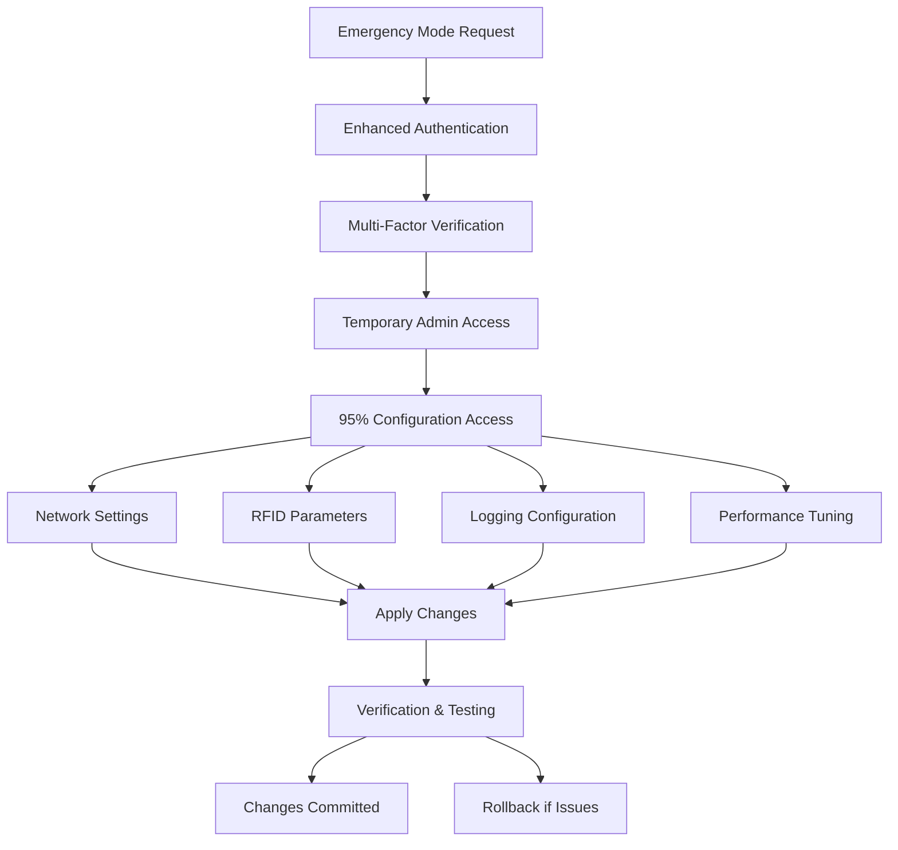
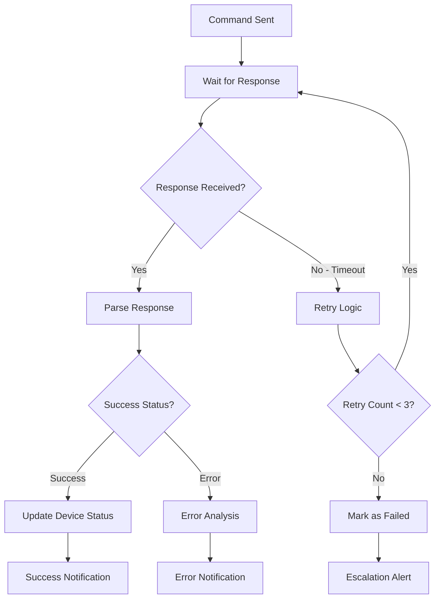

# Workflow 2: Remote Device Management

## **Overview**
Enables remote control and management of RFID devices, allowing operators to perform device reset operations and configure devices from the central dashboard without physical intervention.

## **Business Objectives**
- Minimize downtime through remote troubleshooting
- Reduce field service calls by 60%
- Enable proactive device maintenance
- Provide 95% remote configurability for critical operations

## **Workflow Architecture**



## **Detailed Process Flow**

### **Step 1: Command Initiation**

#### **1.1 Dashboard Interface**


#### **1.2 Device Reset Options**
**Single "Device Reset" Button with Dropdown Menu:**
- **Full Reboot**: Complete device power cycle, clears all memory and restarts hardware
- **Service Restart**: Restart RFID services only, maintains system state and connections
- **Config Refresh**: Reload configuration files without service interruption
- **Emergency Config**: Remote shell access for critical configurations

#### **1.3 User Interface Elements**
- **Device Selection**: Click or hover on device markers
- **Device Reset Button**: Single unified button with dropdown options
- **Reset Type Selector**: Choose between Full Reboot/Service Restart/Config Refresh
- **Progress Indicators**: Real-time command execution status
- **Confirmation Dialogs**: Prevent accidental command execution

### **Step 2: Command Validation & Authorization**

#### **2.1 Pre-Command Validation**


#### **2.2 Authorization Matrix**
| User Role | Device Reset | Emergency Config | Notes |
|-----------|-------------|------------------|-------|
| NEC General | ✅ All Options | ✅ Full Access | Complete control over all devices |
| NEC Admin | ✅ All Options | ✅ Limited | Reset + basic config only |
| NEC Engineer | ✅ Regional Only | ❌ No Access | Region-limited reset capabilities |

#### **2.3 Safety Checks**
- **Device Health**: Verify device can handle command
- **Traffic Impact**: Check if command affects active transactions
- **Timing Validation**: Prevent commands during peak traffic
- **Dependency Check**: Ensure no dependent systems affected

### **Step 3: Command Execution**

#### **3.1 Fixed Reader Command Execution**


#### **3.2 Handheld Device Command Execution**


#### **3.3 Vendor-Specific Implementations**
- **BCIL Devices**: REST API with JSON payload
- **ZEBRA Devices**: SNMP commands with custom MIBs
- **IMP/ANJ Devices**: Telnet-based command interface
- **Legacy Devices**: Fallback to manual procedures

### **Step 4: Automated Threshold-Based Actions**

#### **4.1 Auto-Reboot Triggers**


#### **4.2 Smart Scheduling**
- **Peak Traffic Avoidance**: Delay non-critical commands during high traffic
- **Maintenance Windows**: Schedule commands during low-traffic periods
- **Batch Operations**: Group commands for efficiency
- **Priority Queuing**: Critical commands bypass queue

### **Step 5: Emergency Mode Operations**

#### **5.1 Emergency Configuration Access**


#### **5.2 Emergency Scenarios**
- **Critical Infrastructure Failure**: Mass device configuration
- **Security Incidents**: Rapid security parameter updates
- **Performance Optimization**: Real-time parameter tuning
- **Disaster Recovery**: Automated failover configurations

### **Step 6: Response Handling & Verification**

#### **6.1 Command Response Processing**


#### **6.2 Post-Command Verification**
- **Health Check**: Verify device responds normally after command
- **Function Test**: Confirm RFID scanning capability restored
- **Performance Monitoring**: Check for performance improvements
- **Alert Clearance**: Clear related alerts if command resolved issues

## **Technical Requirements**

### **Command Interface Specifications**
```
Command Structure:
{
  "command_id": "uuid",
  "device_id": "string",
  "command_type": "reboot|restart|refresh|config",
  "parameters": {
    "timeout": "number",
    "force": "boolean",
    "config_data": "object"
  },
  "user_id": "string",
  "timestamp": "datetime"
}
```

### **Vendor Integration APIs**
- **BCIL API**: `POST /device/{id}/command` with JSON payload
- **ZEBRA SNMP**: Custom MIB objects for remote control
- **Generic SSH**: Standardized shell commands for Linux devices
- **APK Interface**: Custom Android application for HHD control

### **Security Requirements**
- **Encrypted Communication**: TLS 1.3 for all command transmission
- **Command Signing**: Digital signatures to prevent tampering
- **Audit Logging**: Complete command history with user attribution
- **Access Control**: Role-based permissions with geographic restrictions

## **Success Metrics**

### **Performance Targets**
- **Command Execution Time**: <30 seconds for standard commands
- **Success Rate**: >98% command completion rate
- **Response Time**: <5 seconds for command acknowledgment
- **Uptime Improvement**: 25% reduction in device downtime

### **Business Impact**
- **Field Service Reduction**: 60% fewer on-site visits
- **Resolution Time**: 70% faster issue resolution
- **Cost Savings**: $500K annual reduction in maintenance costs
- **Operator Efficiency**: 50% faster troubleshooting

## **Dependencies**

### **System Dependencies**
- Device status monitoring service
- User authentication and authorization
- Network connectivity to remote devices
- Vendor API availability

### **Infrastructure Requirements**
- Secure communication channels
- Command queue management system
- Real-time notification service
- Comprehensive audit logging

## **Risk Mitigation**

### **Command Failure Scenarios**
- **Network Issues**: Retry mechanism with exponential backoff
- **Device Unresponsive**: Escalation to field service with full context
- **Vendor API Down**: Queue commands for later execution
- **Security Concerns**: Immediate command disable with alert

### **Safety Measures**
- **Confirmation Dialogs**: Prevent accidental critical commands
- **Command Timeouts**: Automatic failure detection
- **Rollback Capability**: Undo configuration changes if needed
- **Emergency Stop**: Ability to cancel commands in progress
