# Workflow 3: User Authentication & Access Control

## **Overview**
Comprehensive security framework implementing role-based access control with geographic restrictions, ensuring secure access to EIMS functionality based on user roles and operational requirements. Includes advanced admin management capabilities for dynamic role creation, permission control, and user lifecycle management.

## **Business Objectives**
- Enforce role-based security across all system functions
- Implement geographic access restrictions for field engineers
- Maintain audit trails for compliance and security
- Support scalable user management for 100+ concurrent users
- Enable admin-controlled role and permission management
- Provide comprehensive user lifecycle management capabilities

## **Workflow Architecture**

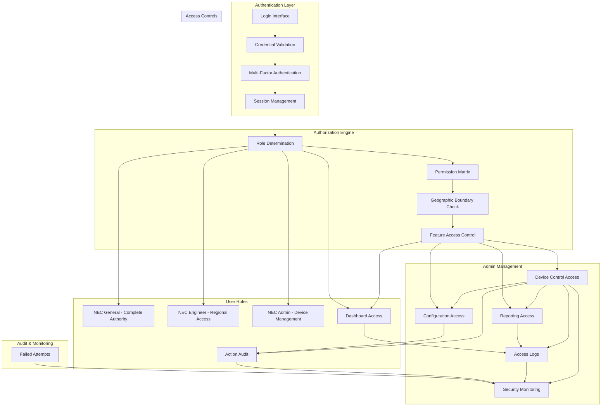

## **Detailed Process Flow**

### **Step 1: User Authentication**

#### **1.1 Login Process**
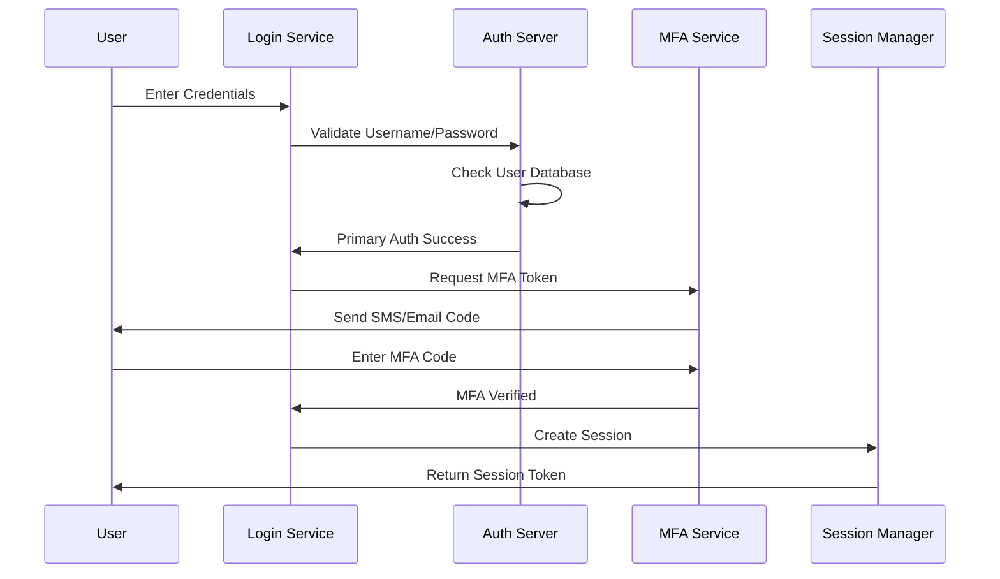

#### **1.2 Authentication Methods**
- **Primary Authentication**: Username and password with complexity requirements
- **Multi-Factor Authentication**: SMS OTP, Email verification, or TOTP
- **Session Security**: JWT tokens with 8-hour expiration
- **Password Policy**: 12+ characters, special characters, regular rotation

#### **1.3 Security Features**
- **Account Lockout**: 5 failed attempts trigger 30-minute lockout
- **IP Restriction**: Whitelist of authorized IP ranges
- **Device Registration**: Trusted device management
- **Concurrent Session Limits**: Maximum 3 active sessions per user

### **Step 2: Role-Based Authorization**

#### **2.1 User Role Definitions**

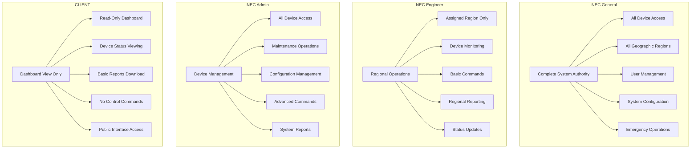

#### **2.2 Permission Matrix**

| Function | NEC General | NEC Engineer | NEC Admin | CLIENT |
|----------|-------------|--------------|-----------|--------|
| **Device Monitoring** | ✅ All Regions | ✅ Assigned Region | ✅ All Regions | ✅ View Only |
| **Device Control** | ✅ All Commands | ✅ Basic Commands | ✅ All Commands | ❌ No Access |
| **Emergency Config** | ✅ Full Access | ❌ Restricted | ✅ Full Access | ❌ No Access |
| **User Management** | ✅ Full Control | ❌ No Access | ✅ Limited Control | ❌ No Access |
| **System Config** | ✅ Full Control | ❌ No Access | ✅ Device Config | ❌ No Access |
| **Reporting** | ✅ All Reports | ✅ Regional Reports | ✅ All Reports | ✅ Basic Reports |
| **Alert Management** | ✅ All Alerts | ✅ Regional Alerts | ✅ All Alerts | ✅ View Only |

#### **2.3 CLIENT Role Detailed Specifications**

**CLIENT User Role** - External stakeholder access with read-only dashboard permissions:

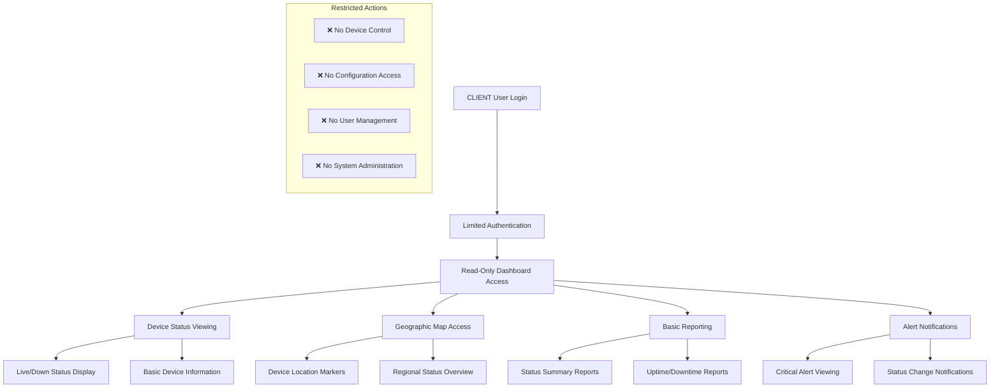

**CLIENT Access Features**:
- **Dashboard Viewing**: Full access to EIMS dashboard interface
- **Device Status**: Real-time status monitoring across all devices
- **Geographic Visualization**: Interactive map with device locations
- **Basic Reports**: Download device status and performance reports
- **Alert Viewing**: See critical alerts and status changes

**CLIENT Access Restrictions**:
- **No Control Commands**: Cannot perform device reset operations or configure devices
- **No Administrative Functions**: Cannot manage users or system settings
- **No Sensitive Data**: Limited access to operational details
- **Read-Only Interface**: All interactive controls disabled
- **No Export Restrictions**: Basic reporting only (no detailed logs)

### **Step 3: Geographic Access Control**

#### **3.1 Regional Boundary Definition**
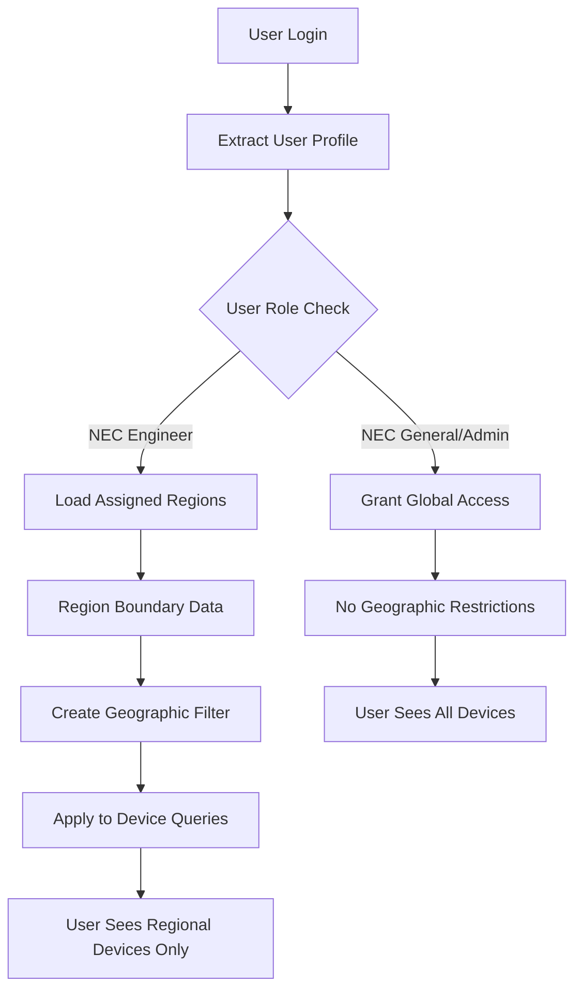

#### **3.2 Regional Assignment Logic**
- **State-Level Assignment**: Engineers assigned to specific states (e.g., Uttar Pradesh, Maharashtra)
- **Toll Plaza Groups**: Multiple toll plazas grouped into operational regions
- **Hierarchical Structure**: Regional managers can access sub-regional data
- **Dynamic Assignment**: Admin can modify regional assignments in real-time

#### **3.3 Geographic Filtering Implementation**
```
Device Query with Geographic Filter:
SELECT * FROM devices 
WHERE location_state IN (user_assigned_regions)
AND device_status IS NOT NULL

Map Display Filter:
{
  "bounds": {
    "northeast": {"lat": 28.7041, "lng": 77.1025},
    "southwest": {"lat": 26.8467, "lng": 75.8648}
  },
  "user_regions": ["Uttar Pradesh", "Delhi"]
}
```

### **Step 4: Feature Access Control**

#### **4.1 Dashboard Access Control**
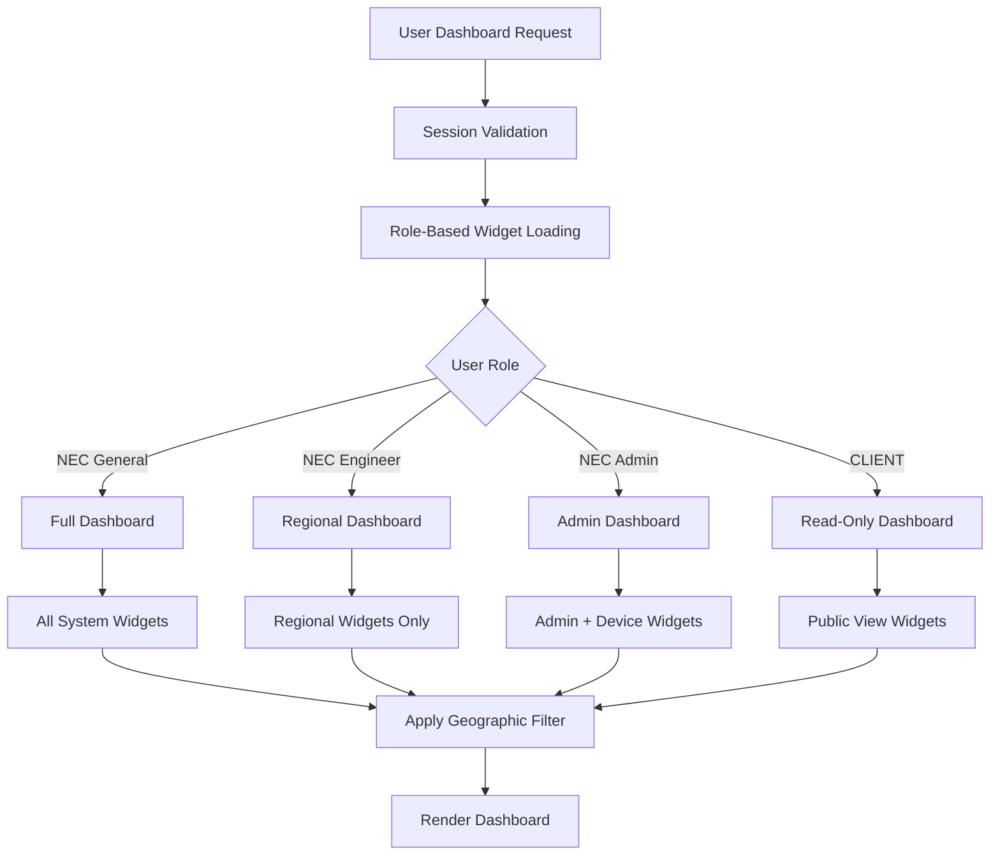

#### **4.2 Command Access Control**
- **Basic Commands**: Available to all authenticated users
- **Advanced Commands**: Restricted to Admin and General roles
- **Emergency Commands**: Highest privilege level required
- **Bulk Operations**: Special permission for mass device operations

#### **4.3 Data Access Restrictions**
- **Device Health Data**: Role-appropriate access levels
- **Transaction Data**: Limited to operational need
- **Configuration Data**: Admin-level access required
- **Audit Logs**: General and Admin access only

### **Step 5: Session Management**

#### **5.1 Session Lifecycle**
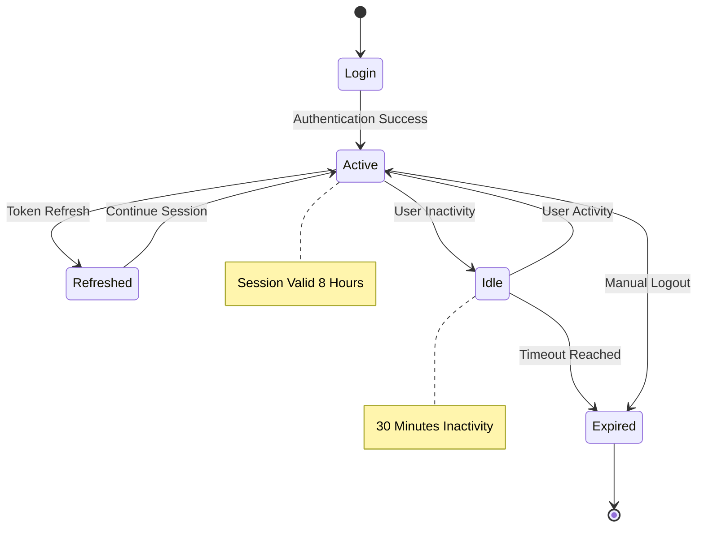

#### **5.2 Session Security Features**
- **Token Rotation**: New token issued every 2 hours
- **Inactivity Timeout**: 30 minutes of inactivity triggers warning
- **Concurrent Monitoring**: Track multiple device logins
- **Secure Logout**: Complete session cleanup on logout

### **Step 6: Audit & Compliance**

#### **6.1 Audit Logging Framework**
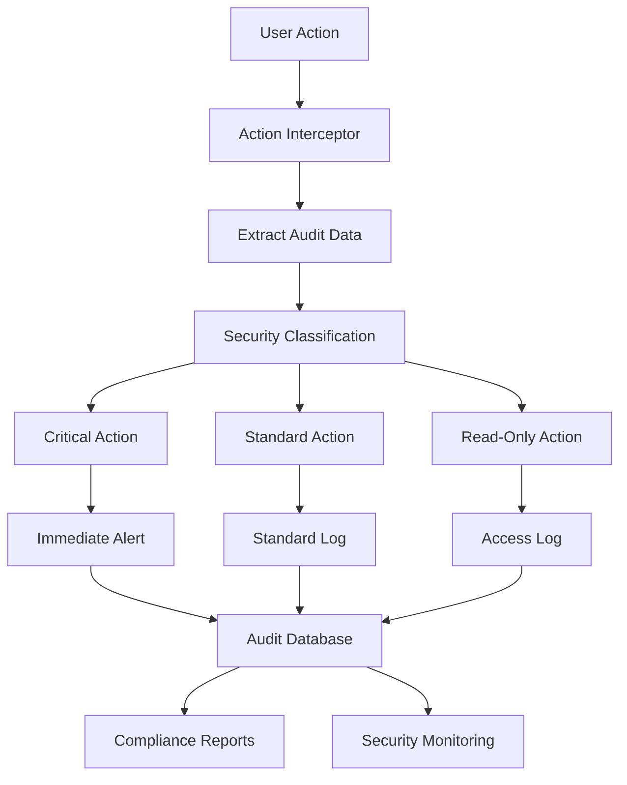

#### **6.2 Audit Data Structure**
```
Audit Log Entry:
{
  "timestamp": "2025-08-30T14:30:00Z",
  "user_id": "engineer.mumbai@nec.com",
  "user_role": "NEC Engineer",
  "action": "device_reset",
  "resource": "device_MAC123456",
  "location": "Mumbai Toll Plaza 1",
  "ip_address": "10.1.2.100",
  "session_id": "sess_abc123",
  "result": "success",
  "details": {
    "device_id": "FR_MUM_001",
    "command": "reset",
    "reset_type": "full_reboot",
    "reason": "high_cpu_usage"
  }
}
```

#### **6.3 Compliance Features**
- **Data Retention**: 7-year audit log retention
- **Access Reports**: Monthly access pattern analysis
- **Security Incident Tracking**: Failed login and suspicious activity monitoring
- **Regulatory Compliance**: GDPR and Indian IT Act compliance

---

### **Step 7: Admin Role & Permission Management**

#### **7.1 Administrative Control Dashboard**
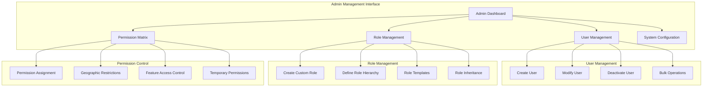

#### **7.2 User Lifecycle Management**

**Admin can perform complete user lifecycle operations:**

##### **Create New User**
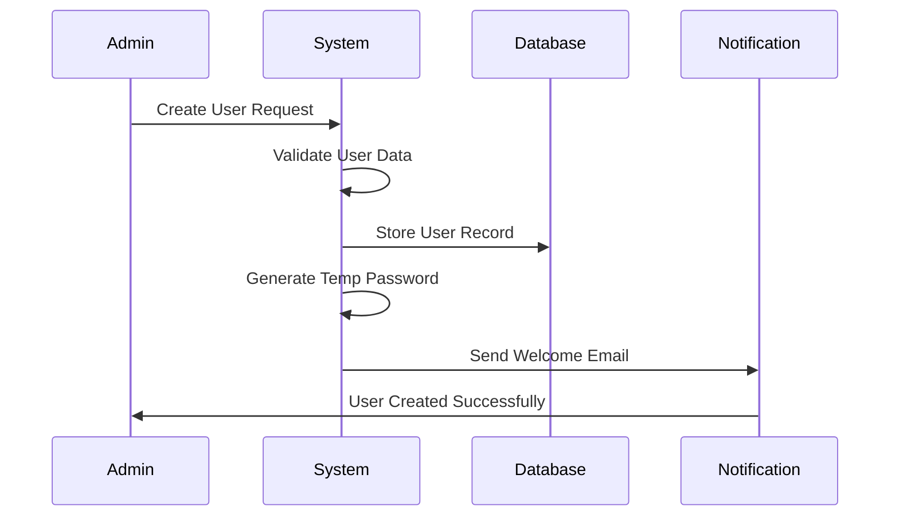

**User Creation Interface:**
- **Basic Information**: Name, email, phone, department
- **Role Assignment**: Select from existing or custom roles
- **Geographic Scope**: Assign regions/states for access
- **Permission Override**: Custom permissions beyond role defaults
- **Account Settings**: Password policy, MFA requirements, expiration

##### **Modify Existing User**
- **Role Changes**: Upgrade/downgrade user roles
- **Permission Updates**: Add/remove specific permissions
- **Geographic Changes**: Modify regional access boundaries
- **Account Status**: Enable/disable/suspend accounts
- **Security Settings**: Reset passwords, MFA requirements

##### **Bulk User Operations**
- **CSV Import**: Bulk user creation from spreadsheet
- **Role Assignment**: Apply roles to multiple users
- **Permission Updates**: Mass permission changes
- **Account Management**: Bulk enable/disable operations

#### **7.3 Custom Role Creation & Management**

##### **Role Definition Interface**
```yaml
Custom Role Creation:
  role_name: "Regional_Supervisor"
  description: "Enhanced engineer with limited admin capabilities"
  parent_role: "NEC Engineer"
  geographic_scope: ["state_level"]
  
  permissions:
    device_management:
      - device_view: true
      - device_reset: true
      - device_config: true
      - emergency_access: false
    
    reporting:
      - generate_reports: true
      - schedule_reports: true
      - export_data: true
      - custom_analytics: false
    
    user_management:
      - view_team: true
      - create_user: false
      - modify_user: false
      - delete_user: false
```

##### **Role Hierarchy Management**
- **Inheritance Rules**: Child roles inherit parent permissions
- **Override Capabilities**: Specific permissions can be overridden
- **Role Templates**: Pre-defined role templates for common use cases
- **Permission Validation**: Ensure role consistency and security

#### **7.4 Advanced Permission Matrix Control**

##### **Granular Permission Assignment**
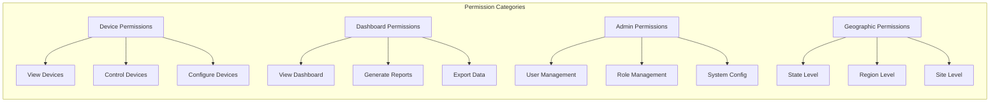

**Permission Matrix Interface:**
- **Visual Matrix**: Grid showing users vs permissions
- **Drag & Drop**: Easy permission assignment interface
- **Bulk Selection**: Select multiple users/permissions
- **Permission Preview**: See effective permissions before applying
- **Conflict Resolution**: Handle overlapping role permissions

##### **Location-Based Access Control**
```yaml
Geographic Access Control:
  user: "engineer.mumbai@nec.com"
  access_levels:
    - level: "state"
      regions: ["Maharashtra"]
      sites: "all"
      
    - level: "city" 
      regions: ["Mumbai", "Pune"]
      sites: ["specific_toll_plazas"]
      
    - level: "site"
      regions: ["Mumbai"]
      sites: ["NH4_Mumbai_Plaza_1", "NH4_Mumbai_Plaza_2"]
```

#### **7.5 System Configuration Management**

##### **Platform-Wide Settings**
- **Security Policies**: Password policies, session timeouts, MFA requirements
- **Notification Settings**: Email templates, alert preferences, escalation rules
- **Integration Configs**: LDB connections, third-party API settings
- **Maintenance Windows**: Schedule system maintenance with user notifications

##### **Audit & Compliance Controls**
- **Audit Log Settings**: Configure what gets logged and retention periods
- **Compliance Reports**: Generate regulatory compliance reports
- **Security Monitoring**: Set up alerting for suspicious activities
- **Access Reviews**: Periodic access certification and cleanup

#### **7.6 Admin Dashboard Features**

##### **Real-time Admin Analytics**
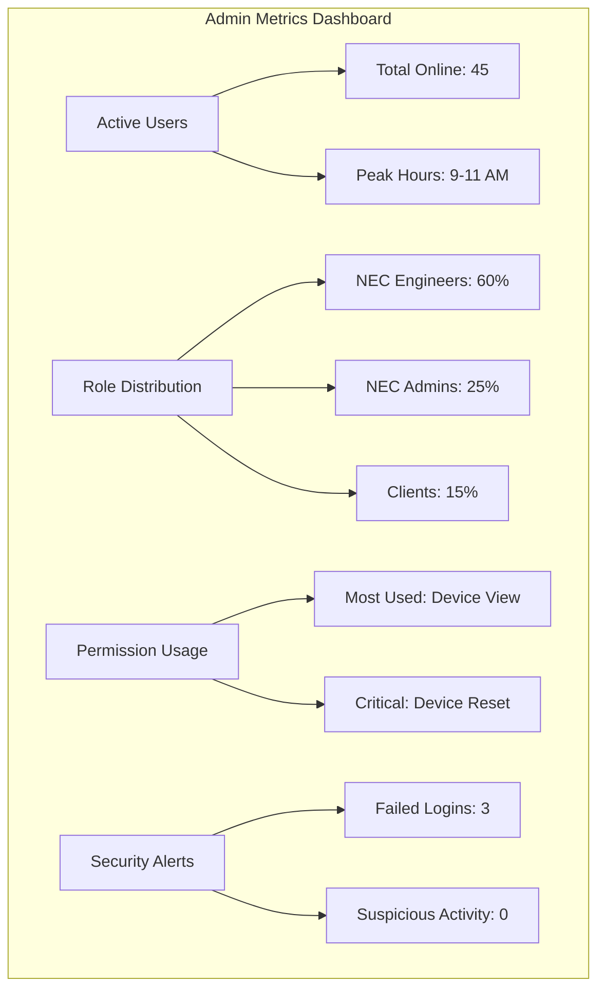

##### **Admin Quick Actions**
- **Emergency User Disable**: Instantly disable compromised accounts
- **Permission Emergency Override**: Temporary permission elevation
- **Bulk Password Reset**: Force password reset for security incidents
- **System-wide Notifications**: Send alerts to all users

#### **7.7 Admin Role Security & Audit**

##### **Admin Action Logging**
```json
{
  "admin_action_log": {
    "timestamp": "2025-09-01T10:30:00Z",
    "admin_user": "admin.system@nec.com",
    "action_type": "role_creation",
    "target_user": "engineer.delhi@nec.com",
    "changes": {
      "role_added": "Regional_Supervisor",
      "permissions_granted": ["device_config", "team_view"],
      "geographic_scope": ["Delhi", "NCR"]
    },
    "justification": "Promoted to team lead role",
    "approval_required": false,
    "ip_address": "192.168.1.100"
  }
}
```

##### **Admin Security Controls**
- **Dual Admin Approval**: High-risk actions require two admin approvals
- **Admin Session Monitoring**: Enhanced logging for admin activities
- **Privilege Escalation Alerts**: Monitor for unusual admin behavior
- **Admin Access Reviews**: Regular audits of admin permissions

---

## **Technical Requirements**

### **Authentication Service Specifications**
```
JWT Token Structure:
{
  "sub": "user_id",
  "role": "nec_engineer",
  "regions": ["uttar_pradesh", "delhi"],
  "permissions": ["device_view", "device_reset"],
  "exp": "timestamp",
  "iat": "timestamp"
}
```

### **Database Schema**
```
Users Table:
- user_id (UUID)
- username (string)
- email (string)
- role (enum)
- assigned_regions (array)
- last_login (timestamp)
- account_status (enum)
- mfa_enabled (boolean)

User_Sessions Table:
- session_id (UUID)
- user_id (UUID)
- token_hash (string)
- created_at (timestamp)
- expires_at (timestamp)
- ip_address (string)
- device_info (json)
```

### **API Security**
- **HTTPS Only**: All communication encrypted with TLS 1.3
- **Rate Limiting**: 100 requests per minute per user
- **CORS Policy**: Restricted to authorized domains
- **Input Validation**: Comprehensive sanitization of all inputs

## **Success Metrics**

### **Security Performance**
- **Authentication Time**: <2 seconds for standard login
- **Session Availability**: 99.9% uptime for authentication service
- **Failed Login Rate**: <1% of total login attempts
- **Security Incident Response**: <5 minutes for critical alerts

### **User Experience**
- **Single Sign-On**: Seamless access across system components
- **Role Transition**: <30 seconds for permission updates
- **Regional Access**: Instant geographic filtering
- **Session Continuity**: Uninterrupted 8-hour work sessions

## **Dependencies**

### **External Dependencies**
- **LDAP/Active Directory**: Enterprise user directory integration
- **SMS Gateway**: Multi-factor authentication delivery
- **Email Service**: Notification and verification emails
- **Network Infrastructure**: Secure communication channels

### **Internal Dependencies**
- **User Database**: Centralized user management system
- **Session Store**: Redis for session state management
- **Audit Database**: Comprehensive logging infrastructure
- **Monitoring System**: Real-time security monitoring

## **Risk Mitigation**

### **Security Risks**
- **Credential Compromise**: Multi-factor authentication and monitoring
- **Session Hijacking**: Token encryption and rotation
- **Privilege Escalation**: Strict role validation and audit logs
- **Data Breach**: Encryption at rest and in transit

### **Operational Risks**
- **System Downtime**: Redundant authentication servers
- **User Lockout**: Emergency access procedures
- **Role Confusion**: Clear role documentation and training
- **Compliance Issues**: Regular security audits and updates
