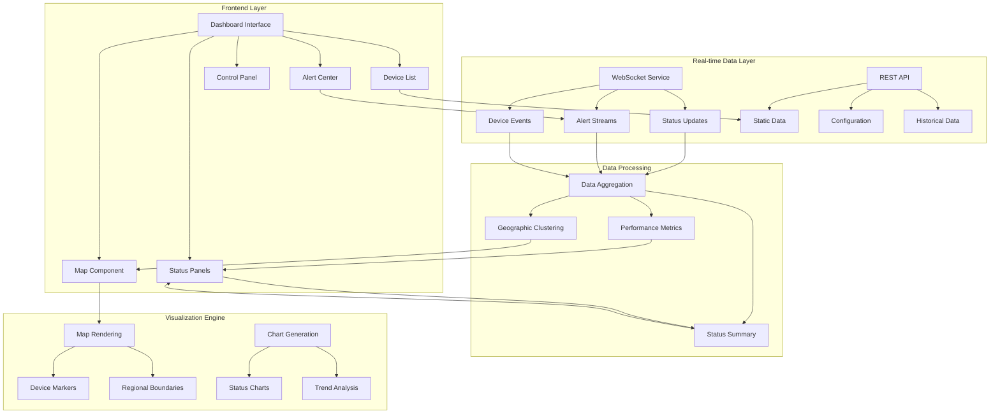
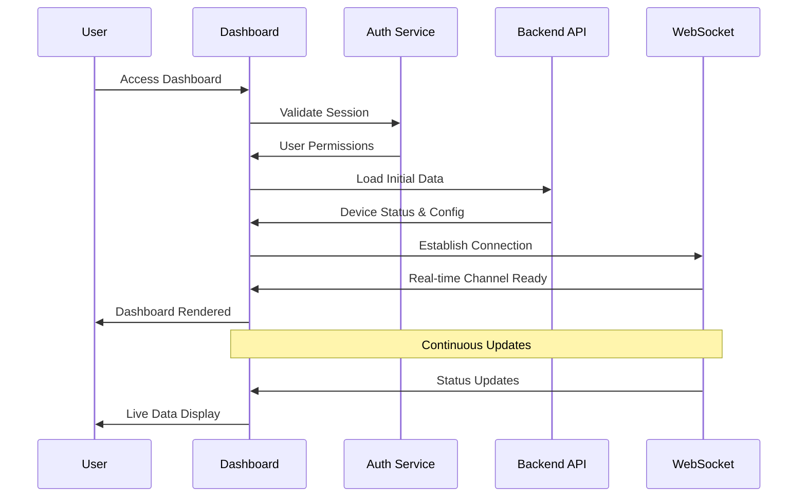
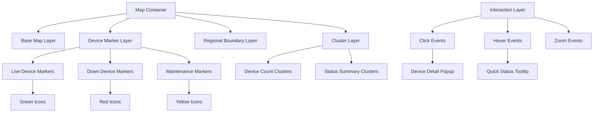
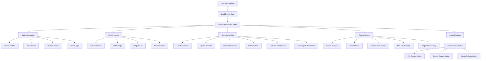
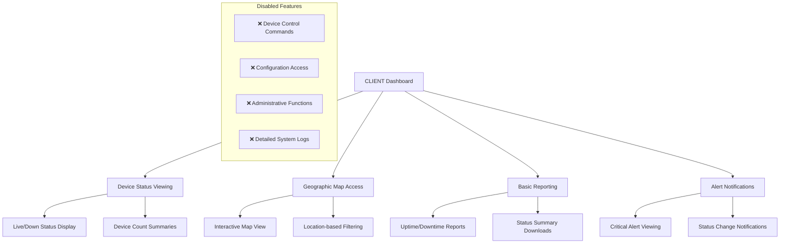
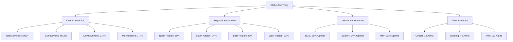
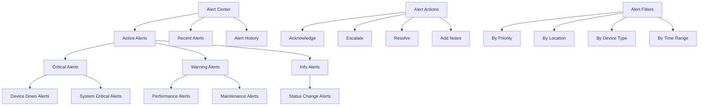
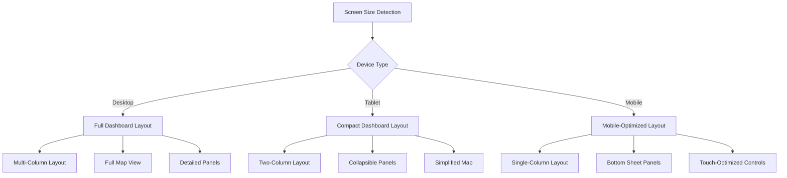

# Workflow 4: Real-time Dashboard Operations

## **Overview**
Interactive dashboard providing real-time visualization of device status, geographic distribution, and operational metrics with responsive design and intuitive user experience for monitoring 5,000+ devices.

## **Business Objectives**
- Provide instant visibility into entire device network status
- Enable rapid identification of issues and trends
- Support decision-making with actionable insights
- Deliver consistent experience across desktop and mobile devices

## **Workflow Architecture**



## **Detailed Process Flow**

### **Step 1: Dashboard Initialization**

#### **1.1 Dashboard Loading Sequence**


#### **1.2 Component Initialization**
- **Map Component**: Load base map with device locations
- **Status Panels**: Initialize counters and metrics
- **Device List**: Populate with filtered device data
- **Alert Center**: Load recent and active alerts
- **Control Panel**: Enable based on user permissions

#### **1.3 User Context Application**
- **Role-Based Layout**: Different layouts for different roles
  - **NEC General**: Full administrative dashboard with all controls
  - **NEC Engineer**: Regional dashboard with limited geographic access
  - **NEC Admin**: Device management dashboard with configuration controls
  - **CLIENT**: Read-only public dashboard with viewing capabilities only
- **Geographic Filtering**: Apply regional restrictions
- **Permission-Based Features**: Enable/disable controls
- **Personalization**: Load user preferences and layouts

### **Step 2: Interactive Map Visualization**

#### **2.1 Map Component Architecture**


#### **2.2 Device Marker System**
- **Status-Based Colors**: Green (Live), Red (Down), Yellow (Maintenance), Gray (Shutdown)
- **Icon Variations**: Different icons for FR vs HHD devices
- **Clustering**: Automatic grouping of nearby devices at lower zoom levels
- **Real-time Updates**: Smooth transitions when status changes

#### **2.3 Interactive Features**
- **Device Selection**: Click to view detailed information
- **Multi-Select**: Ctrl+Click to select multiple devices
- **Zoom Controls**: Smooth zoom with device count adaptation
- **Search Integration**: Search and highlight specific devices
- **Filter Overlay**: Visual filters for device type, status, vendor

### **Step 3: Device Information Panel**

#### **3.1 Device Detail View**


#### **3.2 Health Metrics Visualization**
- **Real-time Gauges**: CPU, RAM, Temperature with color-coded thresholds
- **Trend Charts**: 24-hour historical data for key metrics
- **Status Indicators**: Binary status for antenna, network, power
- **Performance Scores**: Calculated overall device health score

#### **3.2.1 Advanced Status Tracking**
- **Last TAG Read Status**: Flexible timeframe display (configurable 12 months/18 months)
  - Historical TAG read tracking with customizable time windows
  - Visual timeline showing TAG read frequency and patterns
  - Status differentiation based on read activity levels
- **Last Registration Status**: Device registration status visibility
  - Display last registration timestamp and success/failure status
  - Registration history timeline with detailed status tracking
  - Registration success rate and failure pattern analysis

#### **3.3 Context-Sensitive Actions**
- **Status-Based Actions**: Different actions available based on device status
- **Permission-Based Controls**: Hide/show controls based on user role
- **Device-Type Specific**: Different options for FR vs HHD devices
- **Bulk Actions**: Multi-device operations when multiple devices selected

#### **3.4 CLIENT User Dashboard Features**
**Read-Only Dashboard Interface** for external stakeholders:



**CLIENT Access Features**:
- **Dashboard Viewing**: Complete visibility into device status and locations
- **Status Monitoring**: Real-time updates on device health and performance
- **Basic Reporting**: Download device status summaries and uptime reports
- **Alert Viewing**: See critical alerts and system notifications
- **Geographic View**: Interactive map with device location markers

**CLIENT Access Restrictions**:
- **No Control Actions**: All device control buttons and commands are hidden
- **No Administrative Access**: Cannot access user management or system settings
- **Limited Data Export**: Basic reports only, no detailed operational logs
- **Read-Only Interface**: All controls disabled, viewing capabilities only

### **Step 4: Status Summary Panels**

#### **4.1 Executive Dashboard View**


#### **4.2 Dynamic Metrics Calculation**
- **Real-time Aggregation**: Live calculation of status percentages
- **Trend Analysis**: Hour-over-hour, day-over-day comparisons
- **Target Tracking**: Progress toward uptime and performance goals
- **Threshold Monitoring**: Visual indicators when metrics exceed thresholds

#### **4.3 Interactive Status Panels**
- **Drill-Down Capability**: Click on metrics to see detailed breakdown
- **Time Range Selection**: View metrics for different time periods
- **Comparison Mode**: Compare current vs historical performance
- **Export Functions**: Download status reports in various formats

### **Step 5: Real-time Alert Management**

#### **5.1 Alert Center Interface**


#### **5.2 Alert Notification System**
- **In-Dashboard Notifications**: Toast notifications for new alerts
- **Badge Counters**: Number indicators on alert center icon
- **Sound Notifications**: Audio alerts for critical issues (configurable)
- **Browser Notifications**: Desktop notifications when tab not active

#### **5.3 Alert Workflow Management**
- **Alert Acknowledgment**: Mark alerts as seen by operator
- **Assignment**: Assign alerts to specific team members
- **Resolution Tracking**: Track time from alert to resolution
- **Escalation Rules**: Automatic escalation for unacknowledged critical alerts

### **Step 6: Responsive Design & Mobile Support**

#### **6.1 Responsive Layout Adaptation**


#### **6.2 Mobile-Specific Features**
- **Touch-Friendly Controls**: Larger buttons and touch targets
- **Swipe Gestures**: Swipe between different dashboard views
- **Offline Mode**: Basic functionality when connection is poor
- **Push Notifications**: Mobile push alerts for critical issues

#### **6.3 Performance Optimization**
- **Progressive Loading**: Load critical components first
- **Data Compression**: Efficient data transfer for mobile connections
- **Caching Strategy**: Cache static content for faster loading
- **Lazy Loading**: Load components as needed to improve initial load time

## **Technical Requirements**

### **Frontend Technology Stack**
```
Dashboard Framework:
- React.js with Material-UI components
- D3.js for custom visualizations
- Leaflet.js for interactive maps
- Chart.js for standard charts
- Socket.io for real-time updates

State Management:
- Redux for application state
- React Query for server state
- Local Storage for user preferences
```

### **Real-time Data Handling**
```
WebSocket Message Format:
{
  "type": "device_status_update",
  "timestamp": "2025-08-30T14:30:00Z",
  "data": {
    "device_id": "FR_MUM_001",
    "status": "live",
    "sub_status": "active",
    "health_metrics": {
      "cpu": 45,
      "ram": 60,
      "temperature": 38
    }
  }
}
```

### **Performance Requirements**
- **Initial Load Time**: <3 seconds for dashboard
- **Real-time Update Latency**: <1 second for status changes
- **Map Rendering**: <2 seconds for 1000+ device markers
- **Search Response**: <500ms for device search
- **Mobile Performance**: 60fps on mid-range devices

## **Success Metrics**

### **User Experience**
- **Dashboard Load Time**: <3 seconds on standard connections
- **User Engagement**: >80% of users spend >10 minutes per session
- **Mobile Usage**: 30% of access from mobile devices
- **User Satisfaction**: >4.5/5 rating in usability surveys

### **System Performance**
- **Concurrent Users**: Support 100+ simultaneous users
- **Data Accuracy**: Real-time data within 1 second of actual status
- **Uptime**: 99.9% dashboard availability
- **Response Time**: <2 seconds for all user interactions

## **Dependencies**

### **Backend Services**
- Device status monitoring service
- Real-time data streaming service
- User authentication and authorization
- Geographic data and mapping services

### **External Services**
- Map tile services (OpenStreetMap, Google Maps)
- CDN for static assets
- Monitoring and analytics services
- Push notification services

## **Risk Mitigation**

### **Performance Risks**
- **High Device Count**: Implement clustering and virtualization
- **Real-time Data Volume**: Use data compression and batching
- **Browser Memory**: Optimize component lifecycle and cleanup
- **Network Issues**: Implement graceful degradation and retry logic

### **User Experience Risks**
- **Information Overload**: Progressive disclosure and filtering
- **Mobile Performance**: Optimize for low-end devices
- **Browser Compatibility**: Test across all major browsers
- **Accessibility**: Ensure WCAG 2.1 AA compliance
