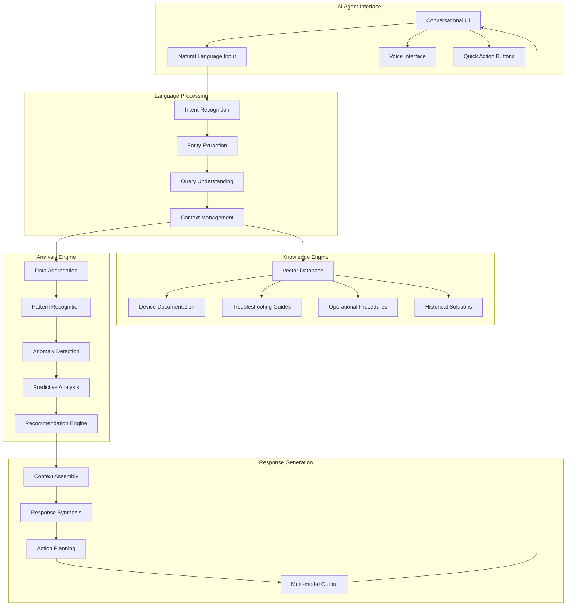
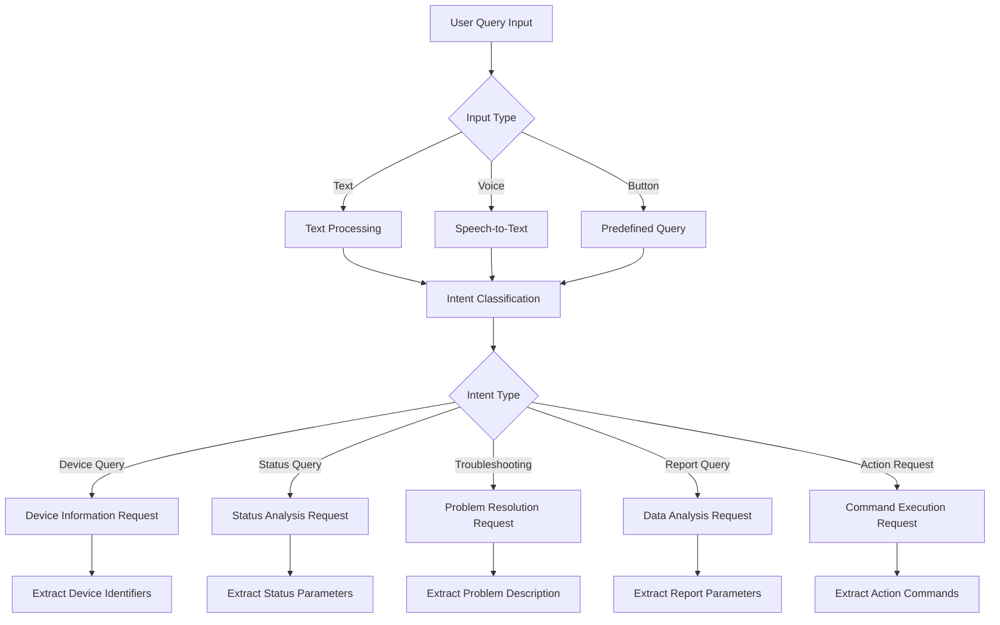
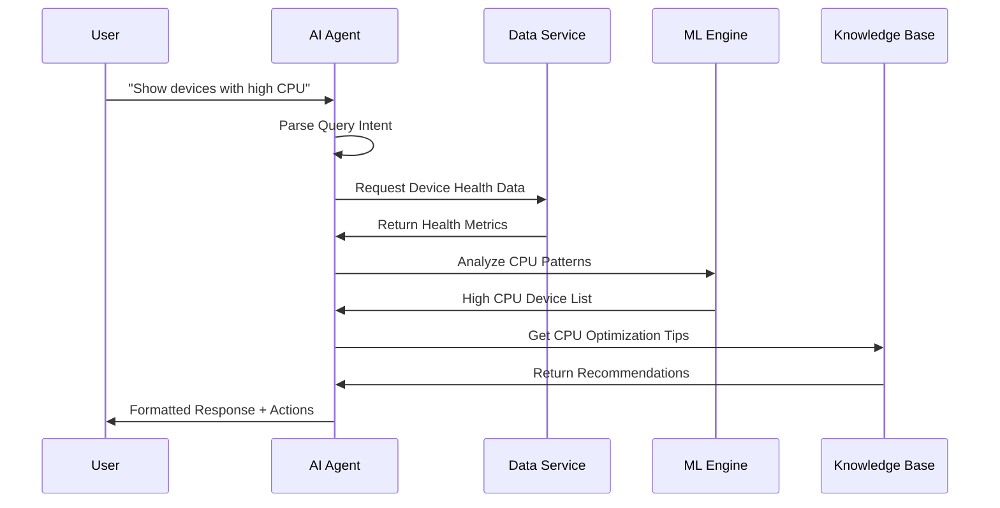
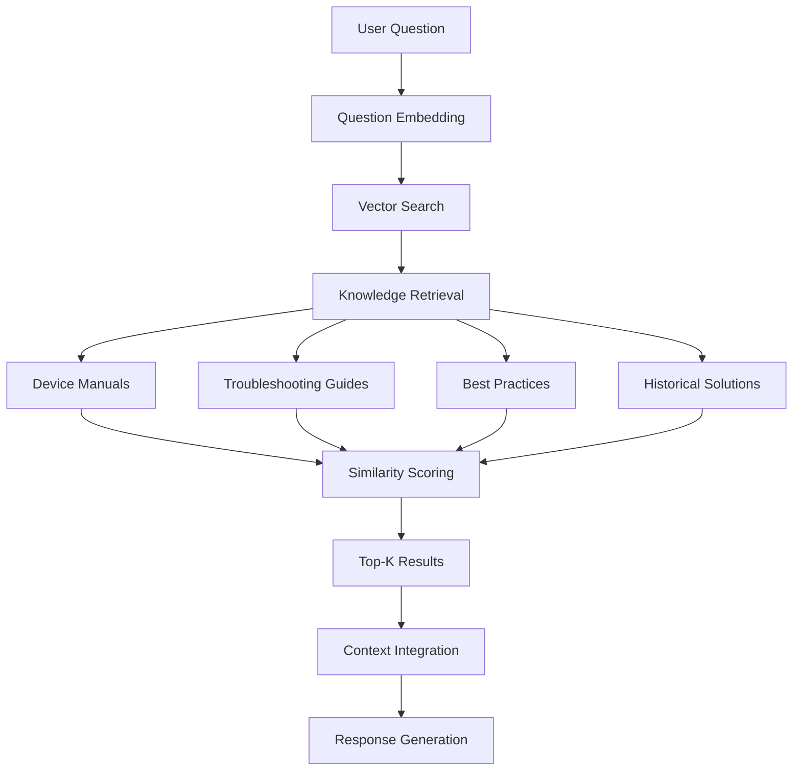
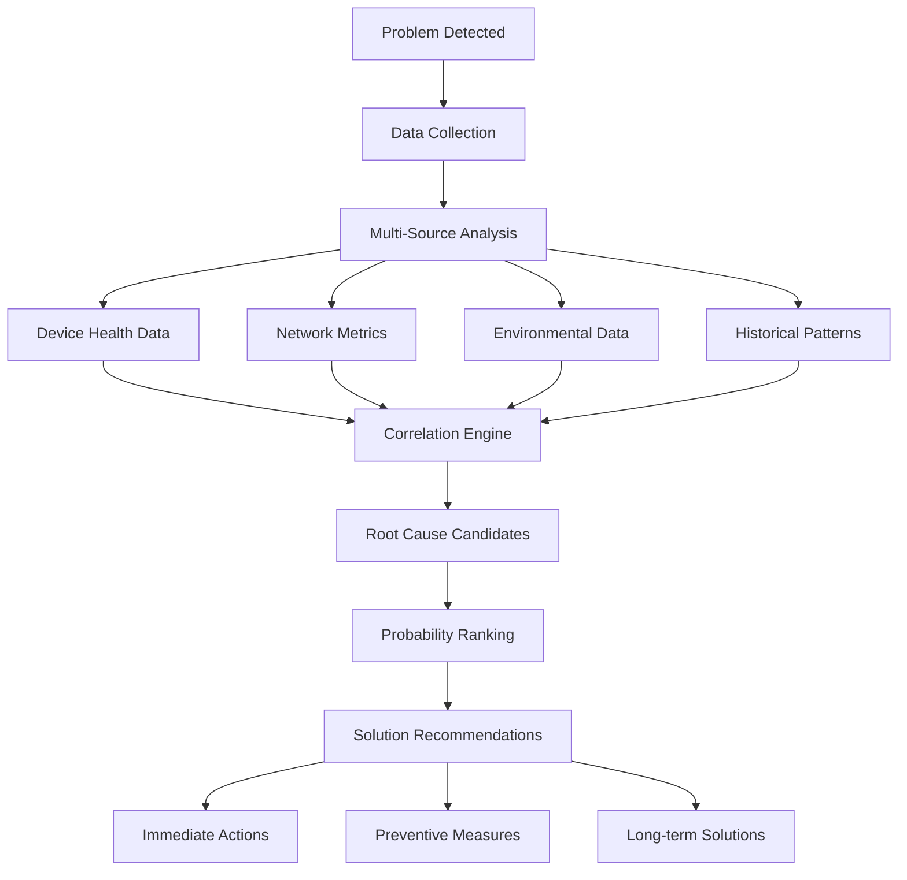
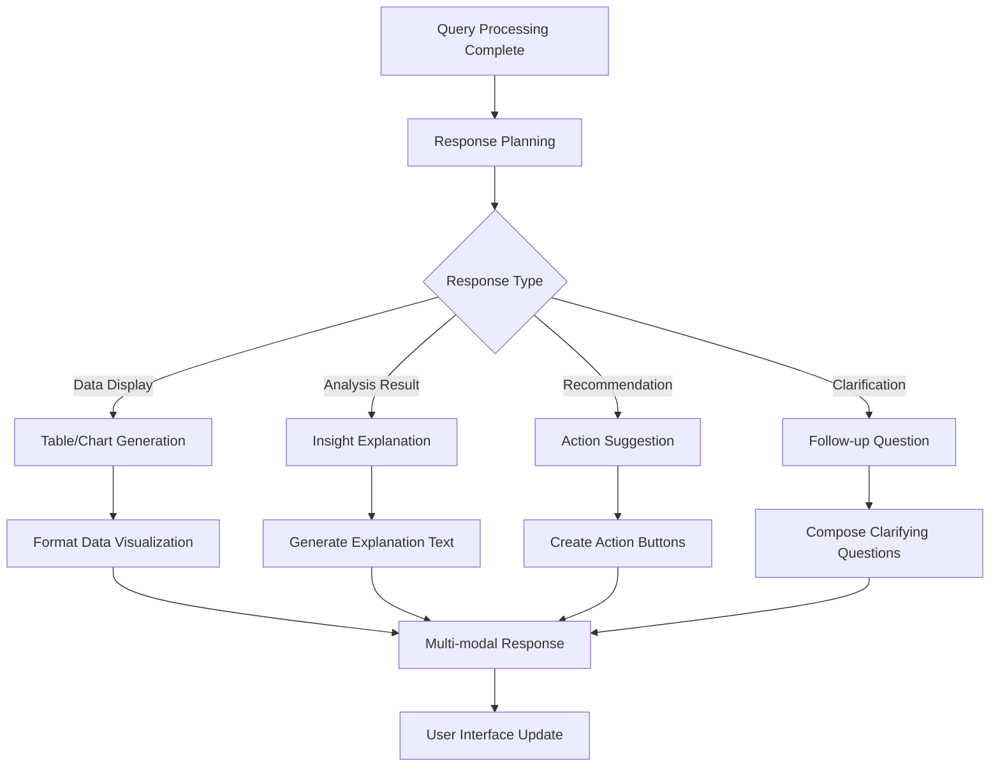
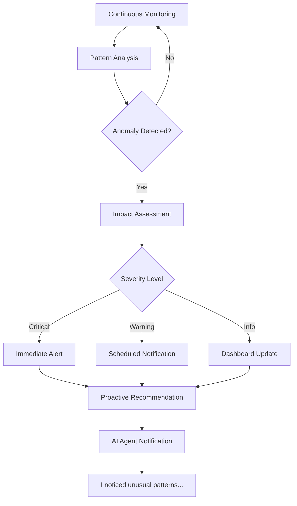

# Workflow 5: AI Agent Operations

## **Overview**
Intelligent AI agent system providing conversational interface, automated analysis, and proactive recommendations for EIMS operations, leveraging natural language processing and machine learning capabilities.

## **Business Objectives**
- Enable natural language interaction with EIMS data
- Provide intelligent insights and recommendations
- Automate routine analysis and reporting tasks
- Reduce operator cognitive load through smart assistance

## **Workflow Architecture**



## **Detailed Process Flow**

### **Step 1: Natural Language Query Processing**

#### **1.1 Query Input & Recognition**


#### **1.2 Example Query Types**
- **Device Queries**: "Show me all down devices in Maharashtra"
- **Status Analysis**: "What's the uptime trend for Mumbai toll plazas?"
- **Troubleshooting**: "Why is device MAC123456 showing high CPU?"
- **Performance Questions**: "Which vendor has the best reliability?"
- **Predictive Queries**: "Which devices are likely to fail this week?"
- **Weather-Impact Queries**: "Which toll plazas are at risk due to upcoming cyclone?"
- **Proactive Maintenance**: "Prepare devices for heavy snowfall in Himachal Pradesh"
- **Environmental Analysis**: "How will monsoon season affect Gujarat highway devices?"
- **Emergency Weather**: "Show weather alerts for all toll plaza locations"

#### **1.3 Context Management**
- **Session Context**: Maintain conversation history and context
- **User Context**: Remember user role, preferences, and access rights
- **Operational Context**: Current system state and recent events
- **Temporal Context**: Time-based queries and historical references

### **Step 2: Intelligent Data Analysis**

#### **2.1 Real-time Data Processing**


#### **2.2 Pattern Recognition & Insights**
- **Anomaly Detection**: Identify unusual patterns in device behavior
- **Correlation Analysis**: Find relationships between different metrics
- **Trend Identification**: Detect improving or degrading performance trends
- **Comparative Analysis**: Compare performance across regions, vendors, time periods

#### **2.3 Predictive Analytics Integration**
- **Failure Prediction**: Identify devices likely to fail
- **Maintenance Scheduling**: Recommend optimal maintenance windows
- **Capacity Planning**: Predict traffic growth and infrastructure needs
- **Performance Optimization**: Suggest configuration improvements

### **Step 3: Knowledge-Based Assistance**

#### **3.1 Vector Database Query System**


#### **3.2 Knowledge Base Content**
- **Device Documentation**: Technical specifications, configuration guides
- **Troubleshooting Procedures**: Step-by-step problem resolution
- **Best Practices**: Operational guidelines and recommendations
- **Historical Incidents**: Past issues and their solutions
- **Vendor Information**: Specific guidance for different device types

#### **3.3 Semantic Search Capabilities**
- **Context-Aware Search**: Understanding query intent and context
- **Multi-Document Synthesis**: Combining information from multiple sources
- **Version Control**: Always provide latest and relevant information
- **Confidence Scoring**: Indicate reliability of information provided

### **Step 4: Automated Root Cause Analysis**

#### **4.1 Multi-Dimensional Problem Analysis**


#### **4.2 Problem Categories & Analysis**
- **Hardware Issues**: CPU, memory, temperature, antenna problems
- **Network Problems**: Connectivity, latency, packet loss
- **Software Issues**: Configuration errors, software bugs, updates needed
- **Environmental Factors**: Power, weather, physical infrastructure

#### **4.3 Solution Recommendation Engine**
- **Immediate Actions**: Quick fixes for urgent problems
- **Step-by-Step Procedures**: Detailed troubleshooting workflows
- **Escalation Criteria**: When to involve field technicians
- **Success Verification**: How to confirm problem resolution

### **Step 5: Conversational Interface Design**

#### **5.1 Response Generation Framework**


#### **5.2 Response Format Examples**
```
Query: "Show me down devices in Mumbai"
Response:
🔴 **Device Status: Mumbai Region**
- **Total Down**: 5 devices
- **Critical Issues**: 2 devices (>2 hours down)
- **Recent Failures**: 3 devices (last 30 minutes)

**Immediate Actions Recommended**:
[Device Reset Selected] [Call Field Team] [Generate Report]

**Details**: FR_MUM_001 (Power Issue), FR_MUM_003 (Network)...
```

```
Query: "Prepare for cyclone approaching Mumbai"
Response:
🌪️ **Weather Alert: Cyclone Impact Analysis**
- **Affected Toll Plazas**: 12 coastal locations
- **Timeline**: Landfall expected in 36 hours
- **Risk Level**: High for power outages, equipment damage

**Automated Actions Initiated**:
✅ Backup power systems activated
✅ Outdoor equipment secured  
✅ Emergency teams alerted
✅ Traffic authorities notified

**Recommended Actions**:
[Secure Equipment] [Deploy Teams] [Monitor Drainage] [Emergency Protocols]
```

#### **5.3 Interactive Elements**
- **Quick Action Buttons**: Direct actions from AI responses
- **Drill-Down Options**: "Tell me more about..." follow-ups
- **Visual Confirmations**: Show affected devices on map
- **Progress Tracking**: Monitor action completion status

### **Step 6: Proactive Intelligence**

#### **6.1 Proactive Alert System**


#### **6.2 Intelligent Recommendations**
- **Predictive Maintenance**: "Device XYZ should be serviced next week"
- **Performance Optimization**: "Increasing buffer size could improve throughput"
- **Cost Optimization**: "Consolidating traffic could reduce infrastructure costs"
- **Risk Mitigation**: "High temperature alerts suggest cooling system review"

#### **6.3 Learning & Adaptation**
- **User Feedback Integration**: Learn from user corrections and preferences
- **Pattern Learning**: Adapt to new device behavior patterns
- **Solution Effectiveness**: Track which recommendations work best
- **Continuous Improvement**: Regular model updates and refinements

## **Technical Requirements**

### **AI Architecture Components**
```
Language Processing Stack:
- Intent Recognition: Custom NLP model
- Entity Extraction: Named Entity Recognition
- Context Management: Conversation state tracking
- Response Generation: GPT-based language model

Knowledge Management:
- Vector Database: ChromaDB/Pinecone for embeddings
- Document Processing: Automated ingestion and indexing
- Similarity Search: Semantic search with relevance ranking
- Knowledge Update: Real-time documentation updates
```

### **Integration Specifications**
```
API Integration:
- Device Data API: Real-time device status and metrics
- Historical Data API: Trend analysis and pattern recognition
- Command API: Execute actions through AI recommendations
- User Context API: Access control and personalization

Response Format:
{
  "query": "user_query_text",
  "intent": "device_status_query",
  "entities": {
    "location": "mumbai",
    "device_type": "fixed_reader",
    "status": "down"
  },
  "response": {
    "text": "formatted_response",
    "data": "structured_data",
    "actions": ["quick_action_buttons"],
    "visualizations": ["charts", "maps"]
  }
}
```

### **Performance Requirements**
- **Query Response Time**: <3 seconds for standard queries
- **Knowledge Retrieval**: <1 second for document search
- **Real-time Analysis**: <5 seconds for complex analytics
- **Concurrent Users**: Support 50+ simultaneous conversations

## **Success Metrics**

### **User Adoption**
- **Query Volume**: >1000 queries per day across all users
- **User Satisfaction**: >4.5/5 rating for AI assistance
- **Task Completion**: 85% of queries result in successful task completion
- **Time Savings**: 40% reduction in time to find information

### **AI Performance**
- **Intent Recognition Accuracy**: >95% correct intent identification
- **Response Relevance**: >90% of responses rated as helpful
- **Knowledge Coverage**: 99% of queries find relevant information
- **Prediction Accuracy**: >85% accuracy for failure predictions

## **Dependencies**

### **Data Dependencies**
- Real-time device status and health data
- Historical performance and maintenance data
- Device documentation and procedural knowledge
- User interaction logs for learning and improvement

### **Infrastructure Dependencies**
- High-performance computing for ML processing
- Vector database for knowledge storage and retrieval
- Real-time data streaming for current system state
- Secure API access for action execution

## **Risk Mitigation**

### **AI Reliability Risks**
- **Hallucination Prevention**: Confidence scoring and source citation
- **Bias Mitigation**: Regular model evaluation and adjustment
- **Knowledge Currency**: Automated updates to knowledge base
- **Fallback Mechanisms**: Traditional interface available when AI fails

### **Security & Privacy**
- **Data Protection**: Encrypt all AI processing and storage
- **Access Control**: Respect user permissions in all responses
- **Audit Logging**: Track all AI recommendations and actions
- **Secure Communication**: End-to-end encryption for all AI interactions
